# Summary {.unnumbered}

- **One input.** The DfT Bus Open Data Service (BODS) SIRI-VM feed, polled every 15 s for a bounding box around Greater London: about 7.5 MB of XML per poll, {{vehicles_per_day_weekday_median|int}} distinct vehicles on a weekday, {{fixes_per_day_weekday_median|int}} GPS fixes per day. TfL-contracted operators (`OperatorRef` TFLO) account for {{tflo_fix_share_pct}}% of fixes.
- **No route data is used.** TfL does not publish timetables or route shapes to BODS. Every route path on the map is learned from the buses' own GPS traces over the last three days and refitted every night: {{learned_routes_total|int}} route-directions in the current snapshot, median fix-to-path residual {{learned_residual_p50}} m.
- **Positions on the map are filtered along the learned path.** A one-dimensional Kalman filter runs on arc length, so lateral GPS drift is discarded by projection and buses follow corners between fixes. Between fixes the displayed position coasts with a decaying speed bounded by 96 m, because showing a bus ahead of where it is costs more than showing it behind.
- **Diversions are detected from the traces, not from notices.** A vehicle counts as diverting only after five off-path fixes, 60 s and 300 m of real movement, bracketed by on-path fixes on both sides. Two vehicles at the same site make an event; an event turns green only after two vehicles have driven the whole skipped stretch again. Over {{ev_logged_days}} logged days the detector displayed {{ev_displayed|int}} events, a median of {{ev_displayed_per_day_median}} per day; {{tfl_match_pct}}% of them sit within 250 m of a TfL road disruption record, rising to {{ev_match_10veh_2routes.pct}}% for events with ten or more vehicles on two or more routes.
- **It runs on one small instance.** Median resident memory {{rss_mb_p50}} MB, of which the JavaScript heap is {{heap_mb_p50}} MB; the fleet-wide filter costs about 110 covariance updates per second.
- **What it cannot do, and what would fix it.** It sees that buses are slow, not how late they are (no stop arrival times). Direction labels in the feed are wrong often enough to be the largest single noise source. Detection has no ground truth, so recall is unknown. TfL's own diversion records and stop arrival times would close all three gaps; nothing new needs to be collected.

# Scope and how to read this document

This document covers the bus half of London Live: what is done with the vehicle location feed between the moment a poll returns and the moment a bus icon moves or a road turns red. Two companion documents cover the rail side (train positions inferred from arrival countdowns) and the backend (architecture, budgets, cost). They are referenced where a boundary is crossed and otherwise left alone.

Readers who want the outcome should read the Summary and @sec-limits. Readers who want the method should read @sec-journeys to @sec-diversions in order; each stage's output is the next stage's input. Readers who want to reproduce a figure or a number should start at @sec-repro and the appendices: every constant named in the text appears in @sec-params with its value, unit and the file it lives in, and every figure is generated by a script listed in @sec-repro. Terms such as *fix*, *key*, *journey*, *excursion* and *band* are defined on first use and collected in @sec-glossary.

Two conventions. Times are UTC unless marked BST (London was UTC+1 throughout the measurement period). A *route-direction*, written as a key `OPERATOR:line:direction` such as `TFLO:11:inbound`, is the unit everything is learned and detected per; "route" alone means the line number as a passenger would use it.

# Data source: BODS SIRI-VM {#sec-data}

This section follows the *coverage, source, methodology, quality* structure the Department for Transport uses for its own data methodology notes, because the questions a transport data team asks of a feed are the same four.

## Coverage

The backend polls the BODS `datafeed` endpoint with a bounding box that covers Greater London and a margin. Everything inside it is kept, so the data includes TfL-contracted buses, coaches passing through, and outer-London commercial services. @fig-fleet shows the daily totals for the {{days_of_rollups}} archived days.

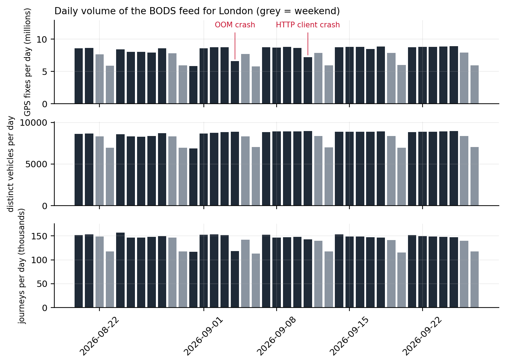{#fig-fleet width=100%}

On a weekday the feed reports a median of {{vehicles_per_day_weekday_median|int}} distinct vehicles and {{fixes_per_day_weekday_median|int}} fixes across {{route_keys_weekday_median|int}} route-direction keys; at the weekend, {{vehicles_per_day_weekend_median|int}} vehicles and {{fixes_per_day_weekend_median|int}} fixes. The operator with the TfL contract code, TFLO, produces {{tflo_fix_share_pct}}% of all fixes; the next largest are {{operator_2nd_name}} ({{operator_2nd_pct}}%) and {{operator_3rd_name}} ({{operator_3rd_pct}}%). Because the bounding box is generous, some keys belong to services that only clip the edge of London, which matters for the learner in @sec-learning: those keys have few complete journeys and are where the learner most often declines to produce a path.

@fig-minute shows the reporting fleet through the day. The weekday morning peak reaches {{fleet_peak_weekday_vehicles_per_minute|int}} vehicles reporting in the same minute at {{fleet_peak_weekday_time_utc}} UTC; the weekend curve rises later and stays flatter.

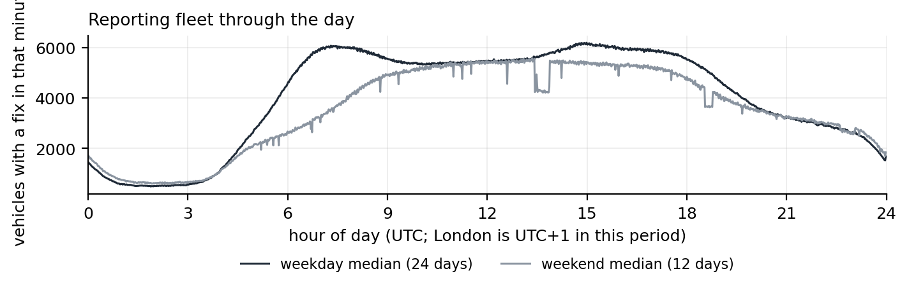{#fig-minute width=100%}

## Source

SIRI-VM is the CEN vehicle monitoring profile [@siri]; BODS republishes each operator's feed unchanged and merges them per request [@bods]. One poll returns one XML document with one `VehicleActivity` element per vehicle. @tbl-fields lists the fields the backend keeps and what each is used for; everything else in the document is discarded at parse time.

| SIRI-VM field | Kept as | Used for |
|---|---|---|
| `OperatorRef` + `VehicleRef` | vehicle id `i` (`TFLO:LTZ1502`) | identity; `VehicleRef` alone collides across operators |
| `LineRef` | line `l` | the route as a passenger names it |
| `DirectionRef` | direction `r`, normalised to `inbound` / `outbound` / lower-cased raw / `unknown` | half of the route-direction key |
| `DestinationName` | `d` | popup text; also a hint when directions are mislabelled |
| `Latitude`, `Longitude` | `y`, `x` (degrees, 6 d.p.) | the fix |
| `Bearing` | `b` (degrees, or null) | icon heading when no motion-derived bearing exists |
| `RecordedAtTime` | `t` (epoch seconds) | the fix time; every filter in this document runs on it, never on wall clock |

: Fields taken from each `VehicleActivity`. Nothing else in the SIRI document is read. {#tbl-fields}

The document is not parsed with an XML parser. At 7.5 MB every 15 s a DOM would dominate the process's memory and garbage-collection time, so the backend scans the text for the element boundaries it needs. One consequence deserves a sentence because it caused an outage: the JavaScript engine's substring operation returns a view onto the parent string rather than a copy, so a retained route number or destination name silently kept the entire 7.5 MB document alive. Every extracted field is now copied through a byte buffer before it is stored. The companion backend document tells the full story.

A fix is *new* when the vehicle's `RecordedAtTime` differs from the last one seen for that vehicle. New fixes are appended, one JSON object per line, to a daily file:

```
{"k":"TFLO:11:inbound","i":"TFLO:LTZ1502","x":-0.13421,"y":51.49812,"t":1790310329}
```

`k` is the route-direction key; the learner, the rollups and the detector are all keyed on it. Files rotate daily in UTC, are kept for seven days and are capped at 2 GB in total; the writer buffers lines and flushes every 5 s so the poll loop never touches the disk. A separate archive job copies each completed day to local storage, which is where the {{scan_days}} days analysed here come from.

## Methodology

The statistics in this section come from one streaming pass over the archived daily files (script `scan-traces.py`), which keeps only the last fix per vehicle in memory and therefore runs in a few minutes per day. Consecutive fixes of the same vehicle give the fix interval and, when 5 to 60 s apart, an implied ground speed. {{fix_pairs_total|int}} fix pairs were measured. {{malformed_lines_total}} lines failed to parse.

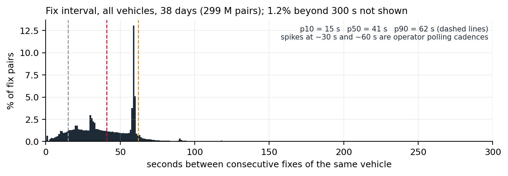{#fig-interval width=100%}

The fix interval (@fig-interval) has a median of {{fix_interval_p50_s}} s and a 90th percentile of {{fix_interval_p90_s}} s; 10% of pairs are within {{fix_interval_p10_s}} s and 1% exceed {{fix_interval_p99_s}} s. {{fix_interval_over_300s_pct}}% of pairs are more than five minutes apart. Three thresholds later in the document are set directly by this distribution: the 60 s window inside which ground movement is trusted (@sec-diversions), the 600 s gap that splits a vehicle's day into journeys (@sec-journeys), and the process noise of the Kalman filter, which must make a full stop-to-cruise speed change within one typical interval statistically unsurprising (@sec-kalman).

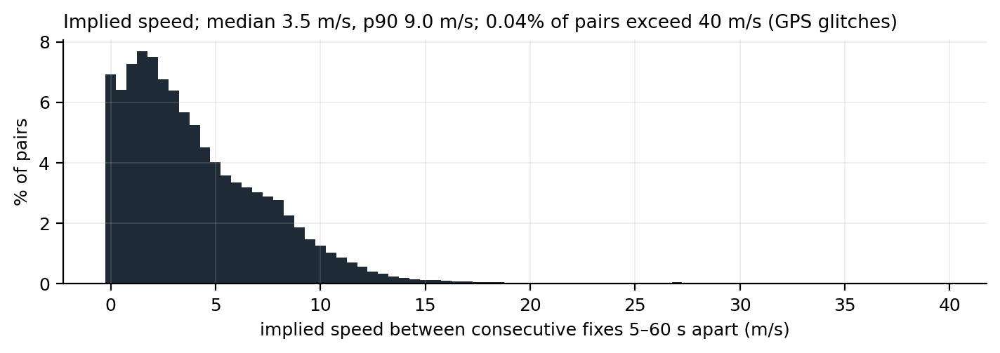{#fig-speed width=100%}

Implied speed (@fig-speed) has a median of {{speed_p50_ms}} m/s and a 90th percentile of {{speed_p90_ms}} m/s; {{speed_glitch_pct}}% of pairs imply more than 40 m/s and are treated as GPS glitches everywhere a speed is used. The feed carries no latency field. The backend measured, at the time the display model was designed, that fixes arrive 10 to 30 s after `RecordedAtTime`; that figure is quoted from the design note rather than re-measured here because the archive stores fix times, not receipt times.

## Quality

Four properties of the feed shape the design more than anything else.

**Positional error is biased, not zero-mean.** In street canyons the same spot drifts by tens of metres in the same direction on every pass. A filter cannot remove bias; projecting the fix onto a known path can discard the lateral component of it, which is the reason the display model works in arc length (@sec-kalman). @fig-cloud shows one day of fixes over a learned path: the cloud is tight along most of the route and visibly offset on a few blocks.

**Direction labels are unreliable.** `DirectionRef` describes the trip the vehicle is scheduled to be on, and it is updated by the operator's system, not by the GPS. It lags at terminals, is sometimes wrong for a whole trip, and a few operators send the same value all day. @fig-journeys shows a route 11 vehicle whose label alternates correctly on 18 round trips, and still produces {{journey_case_mislabelled_fixes}} fixes more than 80 m from the path of the direction they claim. Three separate guards exist because of this field: the layover split in @sec-journeys, the self-overlap test in @sec-learning and the opposite-direction reprojection in @sec-diversions.

**Deadheads are labelled as service.** Vehicles running to and from the garage keep their last line and direction. On @fig-cloud the sparse tail of fixes south of the learned path is a garage run, not a route variant. The learner's corridor and trimmed mean exist to ignore exactly this kind of point; the detector's first-500 m clip and its "wanderer" guard do the same job on the live side.

**Cadence differs by operator.** The 30 s and 60 s spikes in @fig-interval are whole operators reporting on a timer. The display model therefore never assumes a cadence; every timing constant is a bound on real time, not a count of fixes.

# Pipeline overview {#sec-pipeline}

@fig-pipeline shows every component that touches bus data and what flows between them. The live path runs once per poll and never blocks on disk or on the batch jobs; the batch path is self-scheduled from freshness stamps and needs no operating-system cron, so a redeploy or a crash cannot leave it unscheduled.

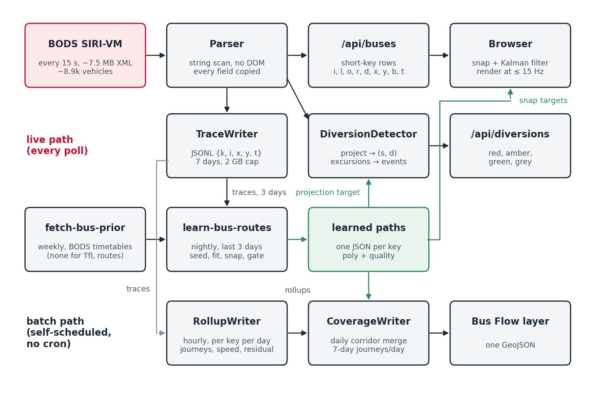{#fig-pipeline width=100%}

The learned polylines are the hinge of the system. The browser snaps to them, the diversion detector projects onto them, the rollups measure residuals against them and the coverage layer is drawn from them. Everything downstream inherits their quality, which is why the learner has a quality gate that would rather ship no path than a wrong one (@sec-learning).

# Journeys: from a vehicle's stream to trips {#sec-journeys}

A vehicle's fixes for a day are one stream. Both the learner and the daily rollups first cut it into *journeys*, and the cut is the same everywhere: a new journey starts whenever the key changes or the gap to the previous fix exceeds 600 s. A journey is *complete*, and eligible for learning, when it has at least 15 fixes, at least 2,000 m of ground track and lasts at least 480 s; shorter fragments are counted but not learned from.

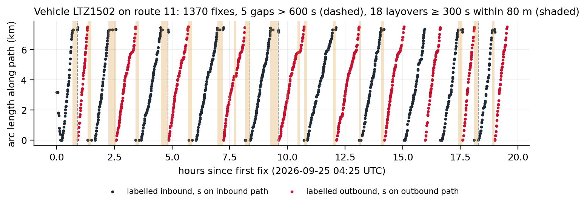{#fig-journeys width=100%}

Where a vehicle turns round quickly, a 600 s gap never occurs and the outbound trip is glued to the inbound one. For the main learning pass this is harmless: the label changes at the terminus, so the key changes and the journey is cut anyway. It is harmful in the one place a single journey is used as a seed (@sec-repair), where a glued out-and-back explains the whole fix cloud and wins on recall. Candidate seeds are therefore also cut at *layovers*: any stretch of 300 s or more in which the vehicle stays within 80 m. Terminal stands are minutes long; bus stops and traffic lights are not. The constants were set after a 591 s stand on route 254 produced exactly this failure. On @fig-journeys the vehicle has {{journey_case_gaps}} gaps over 600 s and {{journey_case_layovers}} layovers.

| | All journeys | Complete journeys |
|---|---:|---:|
| Journeys per weekday (median) | {{journeys.all.n_per_day_median|int}} | {{journeys.complete.n_per_day_median|int}} |
| of which TFLO | {{journeys.tflo_all.n_per_day_median|int}} | {{journeys.tflo_complete.n_per_day_median|int}} |
| Length, median (m) | {{journeys.all.len_m_p50|int}} | {{journeys.complete.len_m_p50|int}} |
| Duration, median (s) | {{journeys.all.dur_s_p50|int}} | {{journeys.complete.dur_s_p50|int}} |
| Fixes per journey, median | {{journeys.all.fixes_p50}} | {{journeys.complete.fixes_p50}} |

: Journey statistics over the {{scan_days}} archived days. "Complete" applies the learner's three thresholds. {#tbl-journeys}

About a third of journeys fail the completeness thresholds (@tbl-journeys). Most of the rejected ones are short: garage runs, the tail of a trip after a mislabelled terminus, or a vehicle that reported for a few minutes and went silent. Rejecting them costs the learner nothing, because a route with enough service to be worth drawing produces hundreds of complete journeys in three days.

# Route shape learning {#sec-learning}

## Problem

For each key with at least 5 complete journeys in the last three days of traces, produce a polyline that a bus on that route-direction actually follows, together with a measure of how well it fits. The path must be usable as a projection target: dense, smooth, oriented in the direction of travel, and free of the garage runs, mislabelled trips and GPS drift that the fixes contain.

Classical map matching [@newson2009; @quddus2007] answers a different question: given a road network, which sequence of road segments did this trace take. It needs a network and it answers per trace. Here there is no route definition to match against for TfL services, and the object wanted is the consensus of hundreds of traces, not any one of them. The approach is therefore closer to a robust average of trajectories than to matching: pick a seed shape, assign every fix to a point on it, and move each point to a trimmed mean of its assigned fixes.

## Seed

If a timetable shape exists for the key it is the seed. BODS publishes timetables per operator as TransXChange; a weekly job downloads the Greater London datasets and bakes one prior per key, with the stop positions. TfL does not publish timetables to BODS, so no TFLO key has a prior and the seed is instead the complete journey whose ground length is the median of all complete journeys for that key. Either way the seed is resampled to a vertex every 25 m, capped at 2,500 vertices. @fig-cloud shows a one-day fix cloud over a path seeded this way.

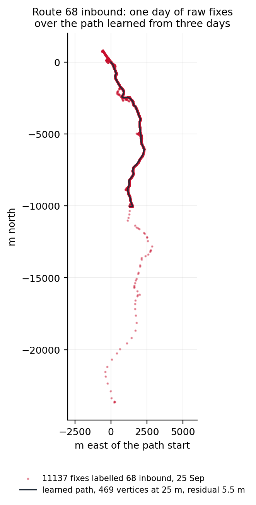{#fig-cloud width=60%}

## Corridor fit

Every fix of every complete journey is projected onto the seed. A fix whose projection distance exceeds 100 m is ignored outright. The remaining residuals set the *corridor* half-width:

$$ w = \min\bigl(60,\ \max(30,\ q_{0.9}(\text{residuals}))\bigr) \ \text{m} $$ {#eq-corridor}

so a clean route gets a 30 m corridor and a noisy one at most 60 m. Each fix inside the corridor is assigned to the nearer of the two vertices bounding its projection segment. A vertex with fewer than 4 assigned fixes keeps its seed position. Every other vertex moves to the trimmed mean of its fixes: sort by residual, drop the worst 20%, average the rest (@fig-vertex). On the route in @fig-vertex the chosen vertex has {{learn_case_vertex_points}} assigned fixes of which {{learn_case_vertex_trimmed}} are trimmed.

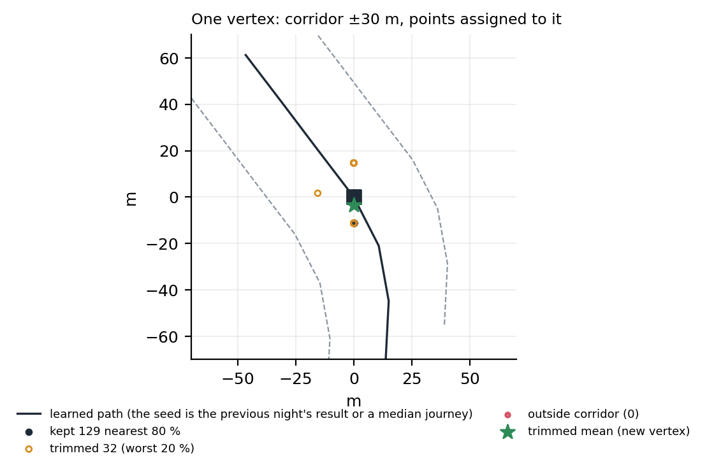{#fig-vertex width=55%}

The trimmed mean is what makes the biased drift of @sec-data tolerable. A vertex on a block where a third of fixes drift 25 m to one side is pulled by the majority, not the average; and because the trim is by residual to the seed rather than by any absolute distance, it adapts to each vertex's own spread.

## Stop anchoring and smoothing

When a prior exists its stops are used: the nearest vertex within 40 m of each stop is moved half way towards it. This is a display refinement, not a correction, and it never applies to TfL routes, which have no prior. All paths then get one pass of 1-2-1 smoothing (weights 0.25, 0.5, 0.25) to remove per-vertex estimation jitter; the end vertices are left alone.

## Quality gate

The fixes are projected again, onto the result this time, on a sample of at most 20,000, and the mean residual is recorded as `meanResidualM`. A path with a mean residual above 35 m is discarded and the previous night's file is left in place. The reasoning is asymmetric: a bus drawn on a wrong path looks worse than a bus drawn on its raw GPS position, so the learner is allowed to say no. @fig-quality shows the distribution across the current snapshot.

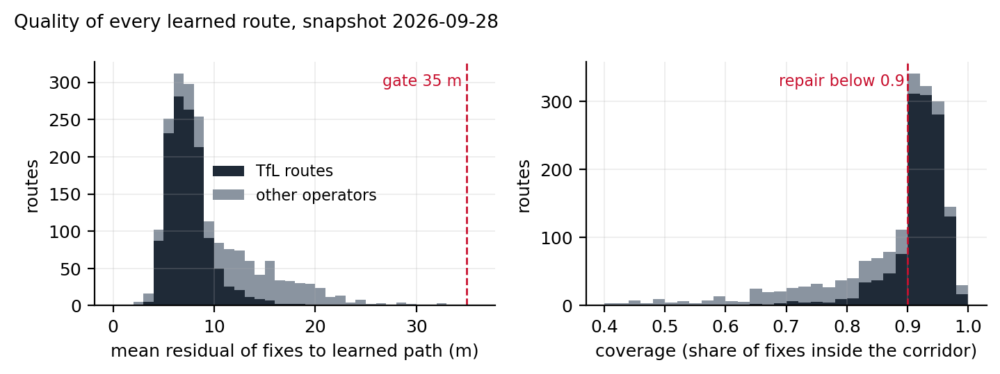{#fig-quality width=100%}

The snapshot holds {{learned_routes_total|int}} route-directions, {{learned_routes_tflo|int}} of them TfL. The median residual is {{learned_residual_p50}} m ({{learned_residual_tflo_p50}} m for TfL routes), the 90th percentile {{learned_residual_p90}} m and the worst shipped path {{learned_residual_max}} m. The median path was learned from {{learned_journeys_p50}} journeys. An independent check from the disruption work gives the same picture: the median distance from a closed bus stop's surveyed position to the learned path of a route serving it is 5 m.

## Coverage measurement and the repair path {#sec-repair}

The residual gate has a blind spot. It measures how far fixes are from the path, but only for fixes that project onto the path within 100 m; a fix that lies on a part of the route the path never reaches is simply not counted. So a path that is too short, or that follows the wrong variant, can pass the gate with a small residual: the fixes it does cover fit it well, and the fixes it misses are invisible to the test. That happens whenever the seed was a bad journey, typically a short working (a trip that turns back half way) or an out-and-back glued together by a quick turnaround.

*Coverage* closes the blind spot by looking at every fix: it is the fraction of all the key's journey fixes that fall inside the finished path's corridor. @fig-lowcov shows a path with a residual of 8.8 m that passes the gate, yet leaves {{lowcov_case_outside_pct}}% of its fixes outside the corridor because the seed journey never took the western loop.

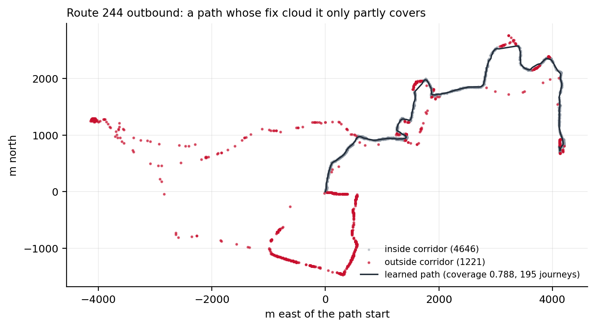{#fig-lowcov width=90%}

For London operators, a coverage below 0.9 triggers a repair, which means choosing a better seed and fitting again. The median-length journey is replaced by the journey that best explains the whole fix cloud. Up to 400 candidate journeys, most-fixes first and additionally cut at layovers, are each scored: *recall* is the share of the key's fixes (sampled to 15,000) that lie within 60 m of the candidate, and *precision* is the share of the candidate's own vertices that have at least 3 fixes projecting onto them. The candidate with the highest product wins; recall alone would favour any long wandering journey, precision alone any short clean one. A candidate that retraces itself, with more than 30% of its vertices within 30 m of an earlier, non-adjacent part of its own path, is rejected as an out-and-back, which is the failure that layover cutting does not always catch. The winner becomes the seed and the whole fit of @sec-learning is repeated. The repaired path replaces the original only if its coverage is higher; otherwise the original stays, on the principle that a repair must prove itself on the same measure that triggered it. The restriction to London operators is deliberate: coach and country services legitimately stray (motorway variants, diversions that last weeks), and re-seeding them from one journey would do harm.

In the current snapshot {{learned_coverage_below_0_9}} paths have coverage below 0.9 after repair; the median coverage is {{learned_coverage_p50}} and the 10th percentile {{learned_coverage_p10}}. The route in @fig-lowcov is one of the unrepaired ones: no single journey explains both variants, and the fit stays with the majority.

## Scheduling

The learner runs inside the backend's scheduler: on startup it runs if the last successful run is more than 20 h old, then every 24 h, with a 60 s delay after boot so the first polls land. The prior fetch runs first when priors are missing or older than 7 days. Each run is a child process with a 45 min timeout; failures are logged and retried at the next cycle and never affect serving. A run is a full recompute from the three-day window and is idempotent; keys that currently lack data keep their previous file. Memory is bounded by processing keys in chunks of at most four million fixes (about 100 MB). @tbl-learner summarises one run on the three days ending {{learner_run_last_day}}.

| | Count |
|---|---:|
| Keys seen in the three-day window | {{learner_keys_seen|int}} |
| Skipped: fewer than 5 complete journeys | {{learner_skipped_insufficient|int}} |
| Keys fitted | {{learner_keys_attempted|int}} |
| Paths written | {{learner_keys_learned|int}} |
| Skipped: degenerate seed | {{learner_skipped_seed|int}} |
| Skipped: residual above 35 m | {{learner_skipped_geometry|int}} |
| Low-coverage repairs kept (coverage improved) | {{learner_repairs_kept|int}} |
| Mean residual over fitted keys (m) | {{learner_mean_residual_m}} |
| Wall-clock time on a laptop (min) | {{learner_duration_min}} |

: One learner run, reproduced locally on the archived traces. {#tbl-learner}

# Snapping and along-route filtering {#sec-kalman}

Everything in this section runs in the browser and affects only where a bus icon is drawn. Its output is never sent back to the server: the route learner (@sec-learning) and the diversion detector (@sec-diversions) both work from the raw fixes as reported, so a filter that pulls positions towards the path can neither reinforce last night's path nor hide the departures the detector is looking for.

## Two models side by side

Every bus on the map is driven by a *raw model*: the last two distinct fixes give a velocity, the position is extrapolated from the last fix time along that velocity, and the icon eases towards the result. This model needs no route and serves every vehicle. When a learned path exists for the bus's key, a second model, the *filtered model*, runs alongside it and takes over the drawing. The raw model keeps two jobs it never gives up: it decides whether the filtered model is engaged, and it seeds the filter when it engages. The filter is not allowed to vote on its own engagement, because a filter that is confidently wrong would otherwise keep itself alive.

## Snap hysteresis

The raw model's eased position is projected onto the learned path. The filter engages when that distance falls below 50 m and releases when it exceeds 80 m. While engaged, the projection searches only the 30 segments either side of the filter's current segment, so a route that passes the same point twice (terminal loops, figure-of-eight ends) resolves to the branch the filter expects rather than the nearest one; a full search is repeated every 3 s as a safety net. @fig-snap shows the distance and the snap state for one vehicle over a day.

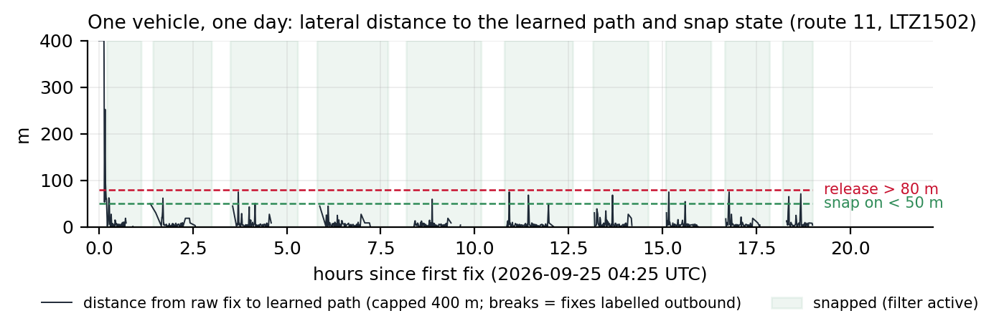{#fig-snap width=100%}

The vehicle in @fig-snap was snapped for {{kf_case_snapped_pct}}% of its {{kf_case_fixes}} inbound-labelled fixes. The unsnapped remainder are fixes at the far terminus that still carry the inbound label, and the single 6 km outlier at the start of the day.

## The filter

The state is arc length $s$ along the path (m), signed speed $v$ along it (m/s), and their $2\times2$ covariance $P$. State time is the fix time. A hat marks an estimate, and a superscript minus marks the *predicted* estimate, before the next fix is folded in: $\hat s^-$ is where the model expects the bus to be, $\hat s$ is the estimate after the fix has been used. Between fixes the state is predicted with constant velocity and a continuous white-noise acceleration model of spectral density $q$:

$$ \hat s^- = s + v\,\Delta t, \qquad P^- = F P F^\top + Q(\Delta t), \quad F = \begin{pmatrix}1 & \Delta t\\ 0 & 1\end{pmatrix}, \quad Q = q\begin{pmatrix}\Delta t^3/3 & \Delta t^2/2\\ \Delta t^2/2 & \Delta t\end{pmatrix} $$ {#eq-predict}

A new fix is projected onto the path to give the measurement $z$ (its arc length). The innovation $y = z - \hat s^-$ is gated at three standard deviations of the innovation variance $S = P^-_{ss} + R$; a fix beyond the gate is rejected and the state is left as predicted. Three consecutive rejections re-seed the filter at the latest fix, on the grounds that the bus really is elsewhere. An accepted fix updates the state with the usual gain:

$$ K = P^- H^\top S^{-1},\quad H = (1\ \ 0), \qquad \hat s = \hat s^- + K y, \qquad P = (I - K H) P^- $$ {#eq-update}

The measurement variance $R$ is per route. The learner's `meanResidualM` is a mean absolute deviation, so it is converted to a standard deviation with the Gaussian factor $\sqrt{\pi/2}\approx1.25$, floored at 8 m because consumer GPS under open sky rarely does better regardless of how clean the residuals look; a route with no quality field is given 44 m, the equivalent of the worst residual the gate lets through. For the route in @fig-track that gives $\sigma_R = 10.3$ m. The initial standard deviations are 30 m in position (the learner's corridor start) and 3 m/s in speed (the raw model's two-fix estimate deserves doubt). Speed is clamped to $\pm20$ m/s and is signed, because a learned path oriented against travel must track as negative speed rather than freeze [@barshalom2001; @cathey2003].

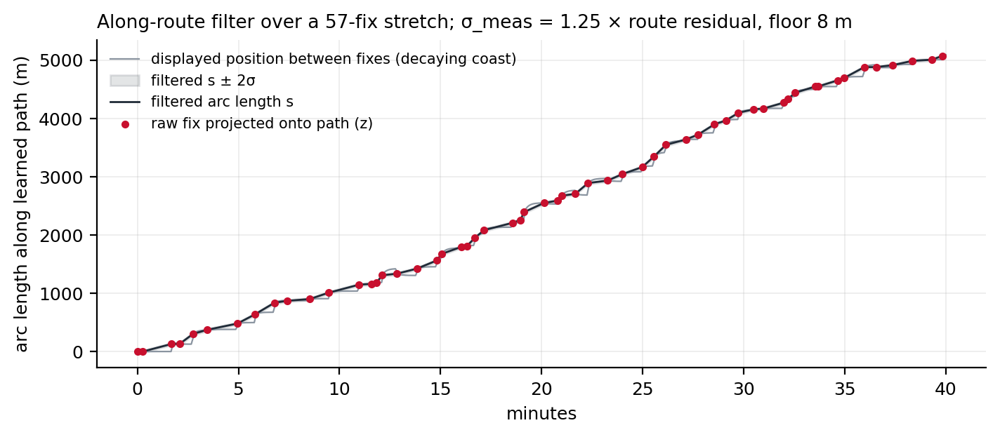{#fig-track width=100%}

The process noise is $q = 2\ \text{m}^2/\text{s}^3$, and its value is the one field revision worth recording. It was first set to 0.2 from the average fix cadence, which models smooth cruising. London buses stop every 300 to 400 m, so between two fixes 20 to 30 s apart the speed regularly swings the full 0 to 13 m/s. At $q=0.2$ that swing was a three-sigma event and the gate rejected 20 to 36% of honest braking and departure fixes in simulation; in production every bus stop produced a reject-then-reset cycle that displayed as a fleet-wide surge and stall. At $q=2$, $\sigma_v(25\,\text{s}) = \sqrt{25 q} \approx 7$ m/s, and the same simulations gate no honest fixes. The smoothing given up is not missed: the filter's real jobs are the along-path motion, the tangent heading and the teleport gate, none of which depend on it. On the day in @fig-snap the filter accepted {{kf_case_accepted}} of {{kf_case_fixes}} fixes, gated {{kf_case_gated}} and reset {{kf_case_resets}} times; the median position standard deviation after update was {{kf_case_sigma_s_p50}} m.

## What the map shows between fixes

The filter's covariance is updated only when a fix arrives, about 110 times per second across the fleet. The per-frame work, at up to 15 Hz, is one extrapolation, one eased scalar and an amortised constant-time walk along the polyline. The extrapolation is not constant velocity. The display objective is asymmetric: a bus drawn behind its true position catches up with a forward glide that reads as driving, while a bus drawn ahead of it has to be pulled back, which reads as reversing and is the single most jarring artefact the map can show. Three rules follow.

1. **Decaying coast.** Between fixes the displayed arc length advances by $v\,\tau\,(1 - e^{-\Delta t/\tau})$ with $\tau = 12$ s (@fig-coast). A silent bus decelerates smoothly and stops within $v\tau$, about 96 m at 8 m/s, less than one stop spacing. The longer the silence, the less credible "still cruising" is, and the budget spends itself accordingly. The raw model coasts with the same decay so that the two models stay co-located during silence; otherwise a release of the snap would yank a halted bus onto a runaway linear extrapolation.
2. **Forward only.** A correction that lands behind the displayed position holds the icon still until the state catches up; it never backs up. The lock direction follows the established travel direction (a $\pm1$ m/s threshold), not the instantaneous sign of $v$, so speed jitter at a stand cannot ratchet the display backwards. Genuine relocations remain representable: a re-seed places the icon directly, and any correction beyond 1.2 km, more than any honest coast backlog, jumps.
3. **Plausible catch-up.** Forward glides are capped at 25 m/s, about three times cruise, so a banked backlog reads as a fast bus rather than a teleport. At the sparser cadences in @fig-interval the resulting rhythm is drive, slow, halt, glide forward; that is the chosen loss ordering (never ahead, then low latency, then smoothness), not a defect.

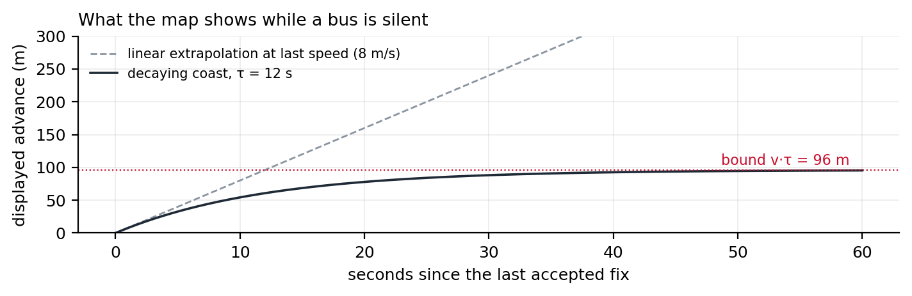{#fig-coast width=100%}

A vehicle that has moved less than 60 m in 20 minutes is drawn as parked, in a different colour, and neither model runs for it.

# Diversion detection {#sec-diversions}

## Definitions

The detector rides the same poll as the trace writer and, for every fix of every vehicle whose key has a learned path, computes the projection $(s, d)$: arc length along the path and unsigned distance from it. A vehicle's fixes are cut into journeys at 600 s gaps exactly as in @sec-journeys, and the first 500 m of ground track of each journey is excluded from evidence because it is where garage pull-outs live. A fix is *off-path* when

$$ d > \max(50\ \text{m},\ 5\times\texttt{meanResidualM}) $$ {#eq-threshold}

with 15 m assumed for a path without a quality field. The threshold scales with the path's own noise so that a route learned through a canyon does not fire on its everyday drift. @fig-h32 (right) shows the two series for one vehicle through a real diversion.

## What counts as an excursion

A run of off-path fixes becomes an *excursion* only when every condition in @tbl-excursion holds. The rejoin requirement is what makes the detector conservative: a vehicle that leaves the path and never comes back (wrong route, garage run, terminus overrun) never produces an excursion, however far it goes.

| Condition | Threshold | Why |
|---|---|---|
| Off-path fixes in the run | at least 5 | one or two drifted fixes are noise |
| Duration of the run | at least 60 s | shorter than any real detour |
| Real ground movement in the run | at least 300 m | distance summed only over consecutive fixes at most 60 s apart, so a gap does not count as movement |
| On-path fixes before and after | at least 2 each side | the vehicle demonstrably left the path and rejoined it |
| Forward progression | median $s$ of the 32 fixes before the exit is less than that after the rejoin | the vehicle continued along its route rather than turning back |
| Ground versus skipped stretch | ground $\le \max(2500\ \text{m},\ 4 \times (s_\text{rejoin} - s_\text{exit}))$ and skipped stretch $\ge 500$ m | a detour's length is commensurate with what it bypasses; a wanderer travels far and skips little |

: Conditions for a run of off-path fixes to become an excursion. {#tbl-excursion}

No smoothing is applied to positions anywhere in the detector: each fix is projected as reported and judged on its own $d$. Robustness comes from counts and durations (@tbl-excursion) and from three medians used as decisions rather than as filtered positions: the before-and-after medians of $s$ that establish forward progression, the median $d$ on the opposite direction's path that catches a wrong direction label, and the per-route rolling median that suspends a route whose learned path is wrong (@tbl-guards).

An excursion records the exit and rejoin arc lengths $s_\text{exit}$, $s_\text{rejoin}$, the maximum $d$, the ground distance, the midpoint of the off-path track and a confidence level.

## Guards, each with the false positive that motivated it

The prototype was audited by hand before it went live, and the production version carries the guards that audit demanded. @tbl-guards lists them with the case each one answers. Two are hard caps on credibility: a $d$ beyond 1,500 m, or a skipped stretch beyond 4,000 m, is not a diversion whatever the fix pattern says. The second cap came from coaches and mis-shaped vehicles that left a route near its start and rejoined near its end, which the bracket logic in the next section then painted as an 11 to 15 km wash across half of north-west London.

| Guard | Rule | The case behind it |
|---|---|---|
| Gap reset | a gap of 180 s or more inside a run restarts the count | a vehicle that went silent mid-street was being credited with movement it never reported |
| Endpoint clamp | if more than 20% of the run's projections sit within 1 m of $s=0$ or $s=s_\text{max}$, or the run stays within 200 m of a path end, discard | terminus overruns and stand movements projected onto the path's last vertex |
| Dwell | if fewer than 30% of the run's fixes are moving (above 2 m/s), confidence LOW | a bus held at a stand off-path is not diverting |
| Mislabel | 15 fixes are reprojected onto the opposite direction's path; if they fit better, discard | a wrong `DirectionRef` makes a normal trip look 30 m off for its whole length |
| Credible distance | $d > 1500$ m discards the run | nothing that far away is a detour around a closure |
| Credible bracket | $s_\text{rejoin} - s_\text{exit} > 4000$ m discards the run | the north-west London wash |
| Shape gate | per route, the rolling median of $d$ over the last 256 fixes is re-evaluated every 64 fixes; while it exceeds the off-path threshold, detection on that route is suspended | routes whose learned path does not follow the traffic (coach services with branching variants, a few quiet routes: median $d$ of 112 to 814 m against 3 to 14 m on healthy routes) produced the worst false events in replay; when the median fix reads as diverted, the shape is wrong, not the traffic. Projection continues, so the gate reopens once the nightly refit repairs the path |
| Memory bounds | at most 4 pending runs and 2,000 fixes per vehicle; vehicle state dropped after 30 min unseen | a bounded process is a prerequisite for running for weeks |

: Production guards on excursion detection. {#tbl-guards}

## From excursions to events

Excursions are clustered by *site*: a new excursion joins the event whose members' midpoints are within 500 m of its own, if that event has had evidence within the last 45 min; otherwise it starts a new one. Within an event, each route-direction key keeps one *bracket* $[s_A, s_B]$ over the path, and every new excursion on that key only widens it: $s_A = \min(s_A, s_\text{exit})$, $s_B = \max(s_B, s_\text{rejoin})$. The band drawn on the map is the learned path sliced from $s_A$ to $s_B$, for every key in the event, at most 12 segments per event.

This is the property most often misread on the map, so it is worth stating plainly: **the red band is the stretch of the original route that buses are skipping, not the detour they take.** Because the bracket is a union over vehicles, it is at least as long as any single vehicle's skipped stretch, and typically longer than most. Buses are legitimately seen on a red band at both ends, where each vehicle leaves and rejoins at its own point, and on the opposite carriageway when only one direction is affected. The union rule was chosen for the same reason as the learner's quality gate: a band that under-reports a closure is worse than one that over-reports its ends by a few hundred metres.

An event is *displayed* once it has two member vehicles. Its *severity* is `road` when at least two route-directions divert at the site (the road itself is the problem) and `partial` when only one does; the map draws them red and amber. Attribution of routes to an event uses only HIGH-confidence members, so a single LOW-confidence dwelling vehicle cannot add its route to the popup.

## Lifecycle

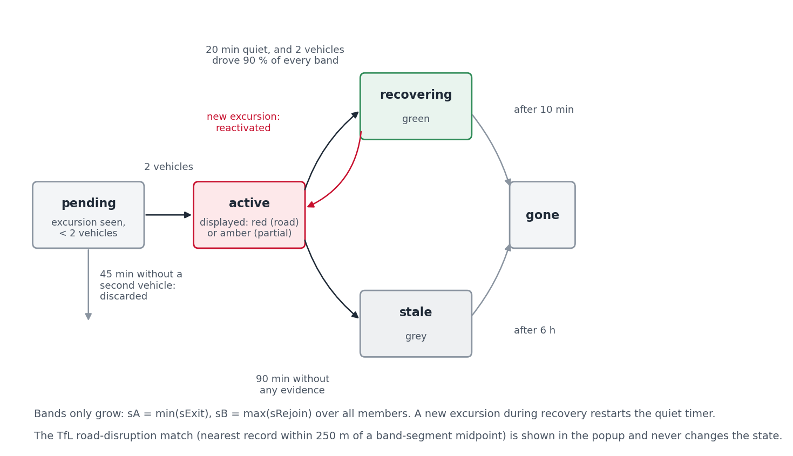{#fig-lifecycle width=100%}

@fig-lifecycle shows the states. An active event becomes *recovering* when two conditions hold at once: no new excursion for 20 min, and at least two vehicles have each driven at least 90% of every drawn bracket end to end (with a 50 m margin) since the last excursion. The second condition is the reason the green colour can be trusted: it is not the absence of evidence, it is positive evidence that the road is passable. A recovering event is dropped 10 min later. If instead an active event receives no evidence of any kind for 90 min it becomes *stale*, drawn grey, and is dropped after 6 h; this is the normal end of an event at night, when there are no buses to prove anything either way. An event older than 24 h is flagged long-running. Every transition is appended to a daily log, and the detector starts empty on boot: events rebuild from live traffic within minutes, so no active-state file needs to survive a restart.

## Matching to TfL road disruptions

Every 10 min the backend refreshes TfL's road disruption list [@tflroad], which gives each incident a category (works, collision, hazard, planned event), a severity and a point. For each displayed event, the midpoint of each drawn band segment is compared with every active disruption, and the nearest within 250 m is attached and shown in the popup with its distance. The match never changes the event's state; it is context, not evidence.

## Case studies

Three events from 22 September 2026 show the detector at its best, at its most independent, and at its most easily misread.

**Camberwell New Road, collision at 13:53 BST.** TfL's record says the road was blocked in both directions at the junction of Wyndham Road. @fig-camberwell shows the fixes of routes 36 and 185 around the site: {{case_camberwell_offroute_fixes|int}} off-path fixes against {{case_camberwell_onroute_fixes|int}} on-path fixes in two hours, and the vehicle {{case_camberwell_vehicle}} leaving its path twice, once each way, with $d$ peaking above 1.4 km. The event was displayed at 14:21 UTC, matched to the collision record 3 m from the band, turned green at 20:42 UTC once two vehicles had driven the stretch again, and was dropped at 20:52. A TfL traffic camera on the corner, viewable from the map, showed free-flowing traffic at that point.

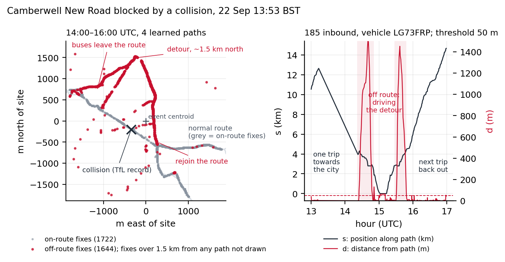{#fig-camberwell width=100%}

**H32 near North Hyde, no notice.** @fig-h32 shows a diversion with no TfL road record within 250 m of the band at the time (the nearest record was works over 100 m away on a different alignment). Every affected vehicle followed the same loop east of the path. The vehicle {{case_h32_vehicle}} turned off at the band's start at 20:33 UTC and was 575 m from the path three minutes later. The event cycled between active and recovering four times during the afternoon and evening as traffic thinned, which is the lifecycle working as designed: each new excursion restarted the quiet timer.

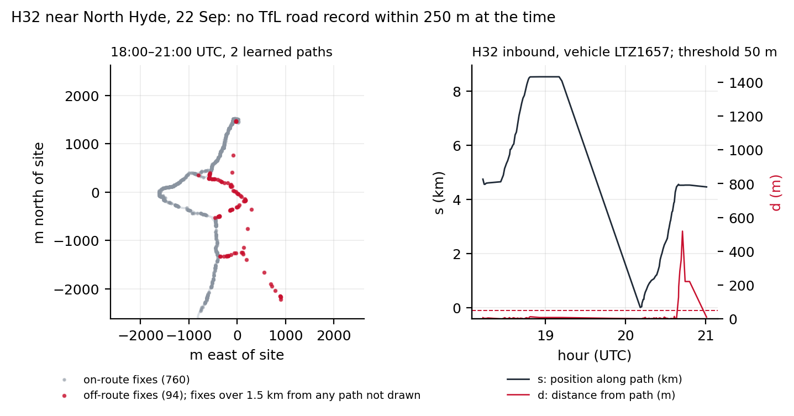{#fig-h32 width=100%}

**Victoria Street, one band for four routes.** Routes 11, 24, 26 and 148 share the closed stretch, and the event carried all four (@fig-victoria). This is the case where the map answers the passenger's third question directly: switching from the 11 to the 24 changes nothing, because both bands are the same band. It is also where the union rule shows: the drawn band is longer than any one vehicle's skipped stretch, and buses were visible on its ends all day.

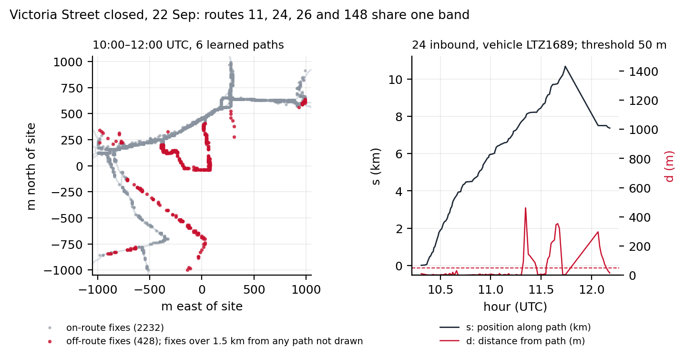{#fig-victoria width=100%}

## What the detector produced

The transition log covers {{ev_logged_days}} days and {{ev_total_ids|int}} event identifiers, of which {{ev_displayed|int}} reached the display threshold of two vehicles: a median of {{ev_displayed_per_day_median}} displayed events per day (@fig-events). Of the displayed events, {{ev_outcomes.recovered|int}} ended in recovery, {{ev_outcomes.stale|int}} went stale and were dropped, and {{ev_outcomes.other|int}} were still open at the end of the log. The median displayed event lasted {{ev_duration_p50_min}} min from first to last evidence (90th percentile {{ev_duration_p90_min}} min), involved {{ev_vehicles_p50}} vehicles (90th percentile {{ev_vehicles_p90}}) and {{ev_routes_p50}} routes; {{ev_share_single_route_pct}}% involved a single route. The weekday peak of new events is at {{ev_peak_hour_utc}}:00 UTC, in the morning ramp-up.

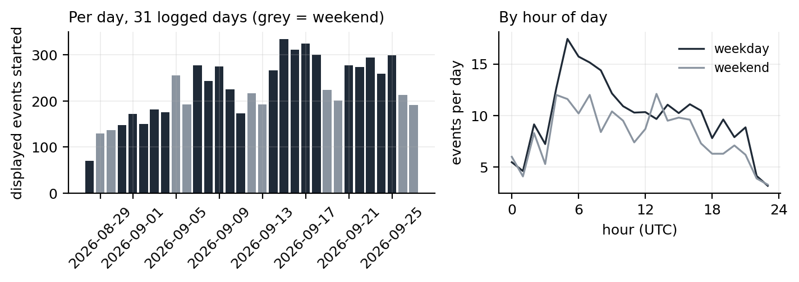{#fig-events width=100%}

The live matcher's results are not in the log, so @fig-match re-derives the TfL match offline: for each displayed event the learned paths of its routes within 1.5 km of the centroid stand in for the band, and the nearest active TfL disruption in the archived snapshot closest in time (median gap {{tfl_snapshot_gap_p50_s|int}} s) is measured against them. {{tfl_match_matched|int}} of {{tfl_match_events|int}} displayed events ({{tfl_match_pct}}%) have a record within 250 m. The rate rises with size: {{ev_match_5veh.pct}}% for events with five or more vehicles, {{ev_match_2routes.pct}}% with two or more routes, {{ev_match_10veh_2routes.pct}}% with ten or more vehicles on two or more routes. Of the matched records, {{tfl_match_by_category.Works|int}} are works and {{tfl_match_by_category.Collisions|int}} collisions.

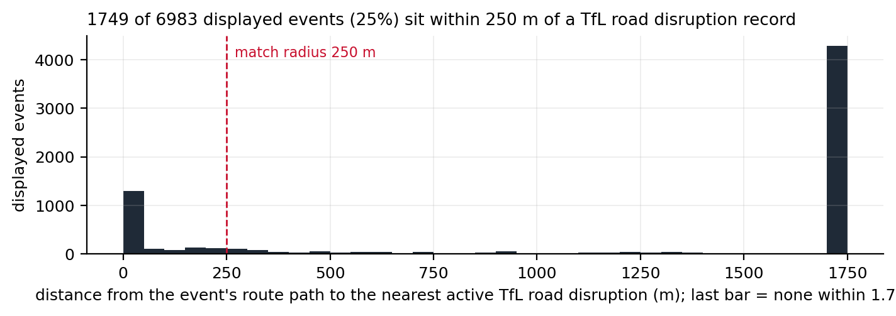{#fig-match width=100%}

Two readings of the unmatched three quarters are both partly true and cannot be separated with the data available. Many small events are diversions TfL's road list does not carry, because that list is dominated by works on the strategic road network and borough-road closures often never appear in it. Some are false positives that the guards did not catch. The H32 case is an example of the first kind; a two-vehicle event on a single route at a garage could be the second. The detector was audited by hand on the prototype (8 of 10 sampled events confirmed, no garage artefacts), and the guards in @tbl-guards each removed a class of error, but there is no ground truth against which to state a recall or a precision. @sec-limits says what would provide one.

# Bus Flow: corridor journey density {#sec-flow}

The Bus Flow layer is derived entirely from artefacts already on disk: the learned paths and the daily rollups. A rollup is written once an hour for every completed UTC day, per key: fixes, vehicles, journeys, a speed histogram in 0.5 m/s bins and the mean residual to the learned path. Rollups are about 250 KB per day and are never deleted, so they are the longitudinal record that outlives the seven-day trace window.

Corridor weights are a rolling mean of journeys per day over the seven most recent completed days, with absent days counted as zero so that weekday and weekend swings are smoothed rather than hidden. Assembly is a corridor merge: routes are walked busiest first, each path resampled to 25 m pieces; a piece landing within 18 m of an already-emitted piece with a compatible bearing (same road, either direction) adds its route's journeys to that piece instead of drawing a second line. Consecutive same-owner pieces merge into runs, split where the summed total crosses a bucket edge. The buckets are absolute lower bounds in journeys per day (0, 10, 30, 75, 150, 300), so a colour means the same service level on every rebuild; quantile edges would recolour untouched corridors whenever unrelated routes changed. The artefact is rebuilt once a day. @tbl-flow gives the result for the current artefact.

| Bucket (journeys/day) | Runs | Corridor length (km) | Share of length |
|---|---:|---:|---:|
| 0 to 9 | {{coverage_by_bucket.0.runs|int}} | {{coverage_by_bucket.0.km|int}} | {{coverage_by_bucket.0.pct}}% |
| 10 to 29 | {{coverage_by_bucket.1.runs|int}} | {{coverage_by_bucket.1.km|int}} | {{coverage_by_bucket.1.pct}}% |
| 30 to 74 | {{coverage_by_bucket.2.runs|int}} | {{coverage_by_bucket.2.km|int}} | {{coverage_by_bucket.2.pct}}% |
| 75 to 149 | {{coverage_by_bucket.3.runs|int}} | {{coverage_by_bucket.3.km|int}} | {{coverage_by_bucket.3.pct}}% |
| 150 to 299 | {{coverage_by_bucket.4.runs|int}} | {{coverage_by_bucket.4.km|int}} | {{coverage_by_bucket.4.pct}}% |
| 300 and over | {{coverage_by_bucket.5.runs|int}} | {{coverage_by_bucket.5.km|int}} | {{coverage_by_bucket.5.pct}}% |

: The Bus Flow artefact for the seven days ending {{coverage_day}}: {{coverage_runs|int}} runs, {{coverage_km_total|int}} km of corridor. {#tbl-flow}

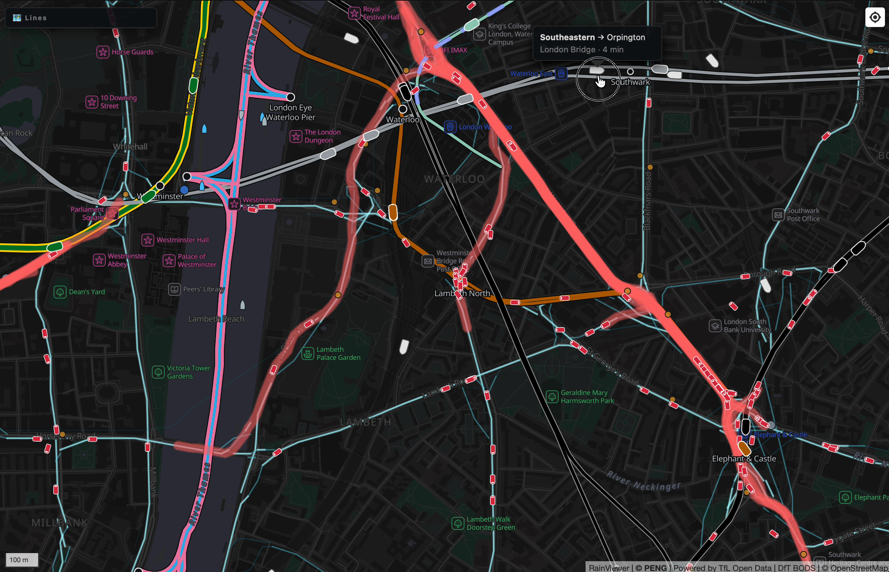{#fig-flow width=100%}

# Operational footprint {#sec-ops}

Everything in this document runs in one Node.js process on one small cloud instance, alongside the rail and other feeds. The backend document gives the architecture and the bill; three numbers belong here. Ingress is 7.5 MB every 15 s, about 43 GB per day, all of it the SIRI document. The in-memory tables are bounded by construction: the detector holds a median of {{vehicle_states_p50|int}} vehicle states, dropping any vehicle unseen for 30 min, and the event store is capped at 500 members per event. @fig-health shows the process over {{health_samples|int}} samples between {{health_first}} and {{health_last}}: median resident memory {{rss_mb_p50}} MB (maximum {{rss_mb_max}} MB), median heap {{heap_mb_p50}} MB. The daily sawtooth in vehicle states is the fleet's day; the restarts on {{restart_days.0}} and {{restart_days.2}} are the two incidents described in the backend document.

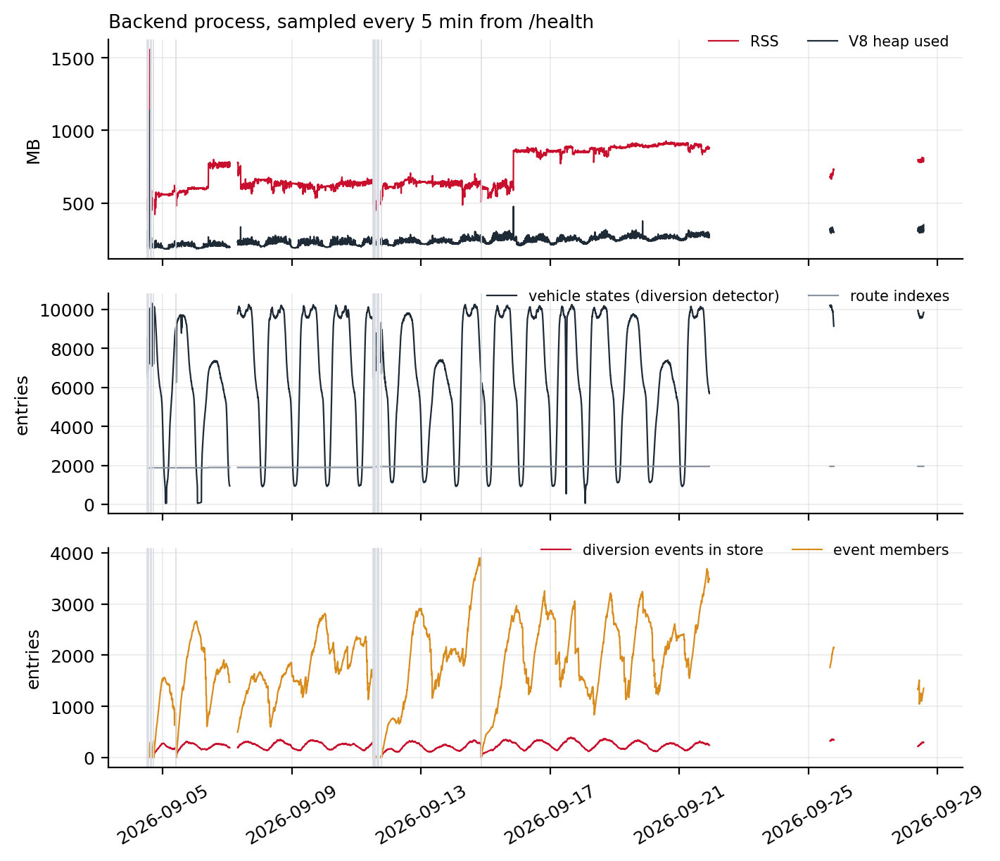{#fig-health width=100%}

The nightly learner is the one heavy job: it streams three days of traces, about {{learner_duration_min}} min of wall-clock time for the run in @tbl-learner, in a separate process so that its memory peak is released afterwards.

# Limitations and what data would help {#sec-limits}

Each limitation below is paired with the data that would remove it. None of the data would need new collection; all of it exists inside TfL.

**Routes with little service have no path.** A key needs five complete journeys in three days. Night routes on quiet nights, school services and short workings fall below it and are drawn from raw GPS. *Timetable shapes for TfL routes* would give every key a prior and let the learner start from the right shape on day one.

**The direction label is the largest noise source.** Three guards exist for it and it still leaks: the {{journey_case_mislabelled_fixes}} far-from-path fixes on @fig-journeys are one vehicle on one day. *The operator's trip identifier per fix* (the SIRI `DatedVehicleJourneyRef`, which some operators populate and TfL's do not) would replace direction inference with a lookup.

**Bands only grow.** The union bracket over-reports the ends of a closure. A 10th-to-90th percentile bracket would be tighter but would need more vehicles before it stabilised; the trade was made in favour of showing something early. *TfL's own diversion and closure records*, with start and end stops, would both calibrate the bracket rule and provide the ground truth the next point needs.

**Detection has no recall figure.** The audit confirmed precision on a sample; nothing measures what was missed. *A month of TfL's diversion log* aligned with a month of traces would give recall, precision and the false-positive classes directly, and would let every threshold in @sec-params be set by optimisation rather than by case.

**The map sees slow, not late.** Speeds and gaps are visible; delay in minutes is not, because the feed carries no stop arrivals and the learner does not know the timetable. *Stop arrival times*, or the iBus arrival predictions TfL already publishes for passengers, joined to the learned paths, would turn "buses are crawling here" into "buses are 11 minutes down here".

**Three days is a design choice.** A diversion that lasts longer than the trace window is learned as the new route, and the detector then sees the original alignment as the diversion until traffic returns. This is intended: the map should show where buses go, and a month-long closure is the route for that month. It does mean that long closures need the notice data, not the detector.

**The archive is the author's.** {{scan_days}} days of feed have been kept locally by pulling each completed day from the server. *A longer historical extract of the SIRI-VM feed for London* would allow the seasonal and week-to-week analyses this document cannot yet support.

# Reproducibility {#sec-repro}

The source is public [@londonlive]. The backend components named in this document are `backend/src/bods-client.ts` (poll and parse), `trace-writer.ts`, `rollup-writer.ts`, `coverage-writer.ts`, `diversion-detector.ts`, `diversion-events.ts` and `learner-scheduler.ts`; the learner is `scripts/learn-bus-routes.mjs` and the prior fetch `scripts/fetch-bus-prior.mjs`; the display model is `frontend/src/realtime/bus-kalman.ts` and `frontend/src/layers/buses.ts`. The learner runs standalone with `BUS_DATA_DIR` pointing at a directory that contains `bus-traces/YYYY-MM-DD.jsonl`; a BODS API key, free to register, is needed to poll the feed.

Every figure and every number in this document is produced by a script in the accompanying `scripts/` directory from the archived daily files, and the text is filled from a single `numbers.json` so that prose and data cannot disagree. @tbl-scripts lists them. The Kalman replay imports the production filter module unchanged.

| Script | Produces |
|---|---|
| `scan-traces.py` | one JSON of histograms per day of traces; @fig-fleet to @fig-speed, @tbl-journeys |
| `fig-5-learning.py` | @fig-cloud, @fig-vertex, @fig-lowcov |
| `fig-5-3-learned-quality.py` | @fig-quality |
| `replay-kalman.ts`, `fig-6-kalman.py` | @fig-snap, @fig-track, @fig-coast |
| `diversion-stats.py`, `tfl-match.py`, `fig-7-8-events.py` | @fig-events, @fig-match, section 7 statistics |
| `fig-7-cases.py` | @fig-camberwell, @fig-h32, @fig-victoria |
| `fig-4-1-journeys.py` | @fig-journeys |
| `fig-9-1-health.py` | @fig-health |
| `fig-diagrams.py` | @fig-pipeline, @fig-lifecycle |

: Scripts behind the figures. {#tbl-scripts}

# References {.unnumbered}

::: {#refs}
:::

# Appendix A. Data schemas {.unnumbered #sec-schemas}

**Trace line** (`bus-traces/YYYY-MM-DD.jsonl`): `{k, i, x, y, t}` as in @sec-data.

**Learned path** (`bus-routes/learned/<key>.json`, `:` replaced by `_` in the file name):

```
{"key": "TFLO:68:inbound",
 "poly": [[lon, lat], ...],                      // 25 m spacing, oriented with travel
 "quality": {"journeys": 202, "meanResidualM": 5.5, "coverage": 0.913}}
```

**Prior** (`bus-routes/prior/<key>.json`): `{poly: [[lon, lat], ...], stops: [[lon, lat], ...]}`.

**Rollup** (`bus-rollups/YYYY-MM-DD.json`): `{day, generatedAt, totals: {fixes, vehicles, routes, journeys, malformedLines}, routes: {<key>: {fixes, vehicles, journeys, speedMs: {p25, p50, p75, samples}, meanResidualM}}}`.

**Event transition** (`diversions/YYYY-MM-DD.jsonl`): `{t, id, transition, event: {status, displayWorthy, startedAt, lastEvidenceAt, routes[], vehicles, members, centroid}}` with `transition` one of `created`, `displayed`, `recovering`, `reactivated`, `stale`, `dropped`.

**Diversions API** (`/api/diversions`): `{generatedAt, events: [{id, status, severity, startedAt, lastEvidenceAt, routes[], vehicles, longRunning, centroid, segments: [[[lon, lat], ...]], tfl: {loc, dist} | null}]}`.

**Bus wire row** (`/api/buses`): `{i, l, o, r, d, x, y, b, t}`, the fields of @tbl-fields with short keys because the array carries about 9,000 rows every 15 s.

# Appendix B. Parameters {.unnumbered #sec-params}

| Name | Value | Where | Reason |
|---|---|---|---|
| Poll interval | 15 s | bods-client | feed update cadence |
| Fetch timeout | 30 s | bods-client | 7.5 MB download |
| Vehicle stale after | 5 min | bods-client | dropped from the table |
| Trace retention | 7 days, 2 GB | trace-writer | rolling window; rollups keep the history |
| Trace flush interval | 5 s | trace-writer | poll loop never touches disk |
| Journey split gap | 600 s | learner, rollups, detector | see @fig-interval |
| Complete journey | 15 fixes, 2,000 m, 480 s | learner | fragments are not learned from |
| Layover split | 300 s within 80 m | learner (candidates) | terminal stands glue trips |
| Minimum journeys per key | 5 | learner | fewer cannot outvote drift |
| Trace window | 3 days | learner | recency versus support |
| Seed spacing | 25 m, max 2,500 vertices | learner | projection resolution |
| Corridor | 30 to 60 m, p90 of residuals | learner | @eq-corridor |
| Ignored residual | over 100 m | learner | off-route noise |
| Trim fraction | 20% | learner | biased drift |
| Vertex minimum support | 4 fixes | learner | else keep seed position |
| Stop anchor | 40 m radius, pull 0.5 | learner | priors only |
| Residual gate | 35 m | learner | no path beats a wrong one |
| Coverage threshold | 0.9 (London operators) | learner | triggers repair |
| Repair scoring | 400 candidates, 15,000 sampled fixes, 60 m radius, support 3 | learner | recall times precision |
| Self-overlap rejection | 30% of vertices within 30 m of a part over 20 segments earlier | learner | out-and-back seeds |
| Chunk fix budget | 4,000,000 | learner | about 100 MB per chunk |
| Learner schedule | run if last run over 20 h old, then every 24 h; 60 s startup delay; 45 min timeout | scheduler | no cron |
| Prior refresh | 7 days | scheduler | timetables change slowly |
| Snap on / off | 50 m / 80 m | buses layer | hysteresis on the raw model |
| Snap local window | 30 segments; full search every 3 s | buses layer | overlapping route ends |
| Process noise $q$ | 2 m²/s³ | bus-kalman | stop-and-go within one fix gap |
| Innovation gate | 3 σ | bus-kalman | 99.7% |
| Rejects before re-seed | 3 | bus-kalman | bus genuinely elsewhere |
| Initial σ | 30 m, 3 m/s | bus-kalman | corridor start; two-fix speed |
| Measurement σ | 1.25 × residual, floor 8 m, default 44 m | bus-kalman | MAD to σ; GPS floor; worst gated route |
| Speed clamp | ±20 m/s | bus-kalman | signed |
| Coast $\tau$ | 12 s | bus-kalman | bound $v\tau$ |
| Catch-up cap | 25 m/s | bus-kalman | about three times cruise |
| Jump distance | 1,200 m | bus-kalman | beyond any honest backlog |
| Display ease $\tau$ | 2.5 s | buses layer | icon motion |
| Parked | under 60 m in 20 min | buses layer | drawn differently |
| Detector clip | first 500 m of each journey | detector | garage pull-outs |
| Off-path threshold | max(50 m, 5 × residual), default residual 15 m | detector | @eq-threshold |
| Excursion minimums | 5 fixes, 60 s, 300 m real movement (pairs at most 60 s apart) | detector | @tbl-excursion |
| Bracket fixes | 2 on-path each side; progression over 32-fix medians | detector | left and rejoined |
| Wanderer | ground over max(2,500 m, 4 × skipped) or skipped under 500 m | detector | @tbl-excursion |
| Gap reset | 180 s | detector | @tbl-guards |
| Endpoint clamp | 20% of projections within 1 m of an end, or within 200 m of an end | detector | @tbl-guards |
| Dwell | under 30% moving at over 2 m/s → LOW | detector | @tbl-guards |
| Mislabel sample | 15 fixes | detector | @tbl-guards |
| Credible $d$ / bracket | 1,500 m / 4,000 m | detector | @tbl-guards |
| Shape gate | median of 256 fixes, re-evaluated every 64 | detector | @tbl-guards |
| Per-vehicle bounds | 4 pending runs, 2,000 fixes, 30 min TTL | detector | memory |
| Route index rebuild | 24 h | detector | learner cadence |
| TfL snapshot refresh | 10 min | detector | road disruption list |
| Site merge distance | 500 m | events | same closure |
| Event window | 45 min | events | evidence recency |
| Display minimum | 2 vehicles | events | one vehicle is an anecdote |
| Recovery | 2 vehicles, 90% of each bracket, 50 m margin, 20 min quiet | events | positive evidence |
| Stale / drop | 90 min; drop after 6 h (stale) or 10 min (recovering) | events | lifecycle |
| Long-running flag | 24 h | events | popup note |
| TfL match distance | 250 m | events | context only |
| Event caps | 500 members, 12 drawn segments | events | memory, payload |
| Coverage window | 7 completed days | coverage-writer | rolling mean |
| Corridor merge | 25 m pieces, 18 m match, 5 m simplification | coverage-writer | prototype-validated |
| Coverage buckets | 0, 10, 30, 75, 150, 300 journeys/day | coverage-writer | absolute, stable colours |
| Rollup speed histogram | 0.5 m/s bins to 40 m/s; pairs at least 5 s apart | rollup-writer | glitch cut-off |

: Every constant named in this document. {#tbl-params}

# Appendix C. Glossary {.unnumbered #sec-glossary}

**Fix.** One reported position of one vehicle at one `RecordedAtTime`.

**Key.** `OPERATOR:line:direction`, the route-direction; the unit of learning, rollups and detection.

**Journey.** A vehicle's consecutive fixes on one key with no gap over 600 s. *Complete* when it meets the learner's three thresholds.

**Layover.** 300 s or more within 80 m; used to cut candidate seed journeys.

**Seed.** The starting polyline for a key: its prior, or the median-length complete journey.

**Corridor.** The half-width around the seed inside which fixes are assigned to vertices: 30 to 60 m.

**Residual.** Distance from a fix to its projection on a path. `meanResidualM` is the mean over a sample of fixes against the learned path.

**Coverage.** Fraction of a key's fixes inside the learned path's corridor.

**$(s, d)$.** Arc length along a path and distance from it, the projection of a fix.

**Snap.** The state in which a bus is drawn on its learned path and the filter runs; engaged under 50 m, released over 80 m.

**Excursion.** A run of off-path fixes that meets every condition in @tbl-excursion; the unit of diversion evidence.

**Site.** A cluster of excursions whose midpoints are within 500 m; one event.

**Bracket / band.** Per key within an event, $[s_A, s_B]$, the union of members' skipped stretches; the band is the path sliced to it.

**Recovering.** The state entered after 20 quiet minutes and two vehicles driving each band end to end; drawn green.

**Rollup.** The per-day, per-key aggregate written once a day is complete.
