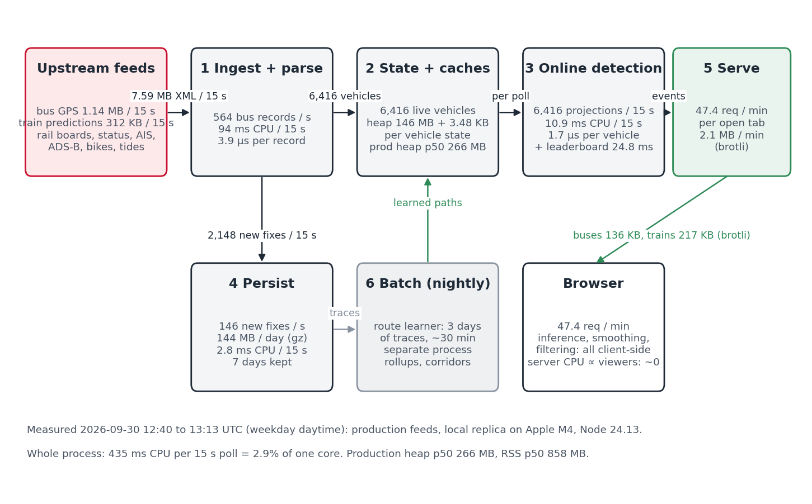
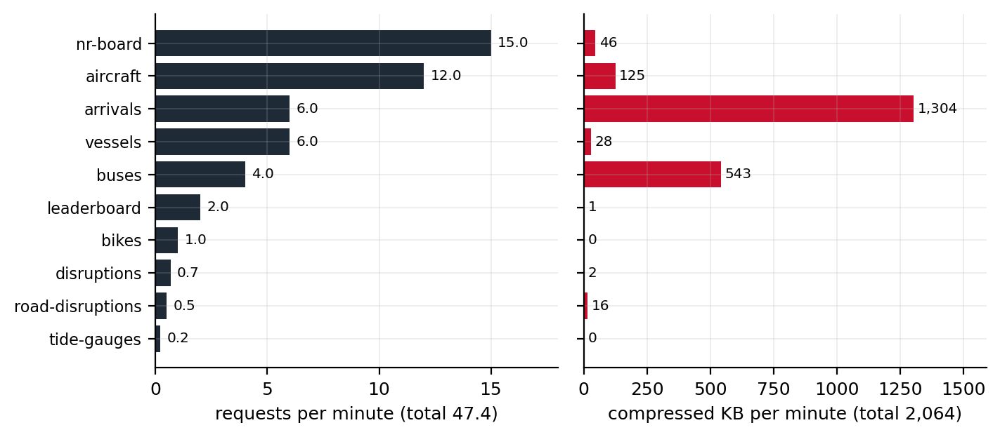

# Summary {.unnumbered}

{#fig-pipeline width=100%}

- **One process, six stages.** Ingest and parse; in-memory state and caches; online detection; persistence; serving; nightly batch. Everything except the nightly route learner runs in a single Node.js process.
- **The input is large, the output is small.** The bus feed alone delivers {{bus_decoded_gb_per_day}} GB of XML per day, {{bus_records_per_s}} records per second; after de-duplication about {{fixes_per_s_mean}} new GPS fixes per second are kept on average over a day ({{new_fixes_per_s_day}} at midday), {{trace_gz_mb_per_day}} MB per day compressed on disk.
- **The whole live path costs about {{d24_cpu_util_pct}}% of one CPU core** at London scale, averaged over a weekday on the reference machine, a laptop: {{d24_cpu_mean_ms|int}} ms per 15 s poll, between {{d24_cpu_hour_min_ms|int}} ms in the small hours and {{d24_cpu_hour_max_ms|int}} ms in the afternoon. About {{d24_cpu_fit_fixed_ms|int}} ms of that is fixed by the feed, which carries almost the same bytes at 01:00 as at 13:00; the rest follows the vehicles in service and the size of the day's leaderboard.
- **Memory is a linear function of two counts.** Heap $\approx$ {{heap_fit_intercept_mb}} MB + {{heap_fit_kb_per_vehicle_state}} KB per tracked vehicle + {{heap_fit_kb_per_lb_total}} KB per leaderboard entry (R² {{heap_fit_r2}} over {{heap_fit_n|int}} five-minute samples); production runs at a median of {{prod_heap_median_mb|int}} MB heap and {{prod_rss_median_mb|int}} MB resident.
- **Viewers add serving work only.** Position inference, smoothing and filtering run in the browser; every tab receives the same cached bodies, so no viewer adds ingestion, detection or upstream calls. A tab costs the origin {{tab_requests_per_min}} requests and about {{tab_kb_per_min|int}} KB per minute after compression, {{tab_share_arrivals_pct}}% of it the train-prediction body, and about {{cpu_main_ms_per_viewer}} ms of main-thread time per 15 s for serialisation, compression and the garbage they make.
- **What would break first** is not CPU. It is memory ceilings on the single process, upstream rate limits, and stale bodies served without an age limit; each has been hit once, and each is now bounded where it bit.

# Scope and how to read this document {#sec-scope}

This is the second of three technical notes on London Live. The first describes how the bus GPS feed becomes route shapes, on-map positions and diversion events; the third will describe how train positions are inferred from arrival countdowns. This one describes the system that runs them: what components exist, what flows between them, and what each costs.

The body is durable by construction. It names components by role, not by file; it states costs as formulas in a small set of parameters (@tbl-params); and it gives no dates. Measured values appear in the body only as the calibration of those parameters, and every one of them is traceable to a dated measurement in [Appendix A](#sec-reference) or a figure caption. When the code or the city changes, the reference section is re-measured, the numbers are regenerated, and the body stands.

Readers who want the numbers should read the Summary and @sec-budget. Readers who want to size a deployment of their own should read @sec-streams and @sec-stages, substitute their own parameters, and check the limits in @sec-limits. Readers who want to find the code should use [Appendix B](#sec-code).

| Symbol | Meaning | London value (daytime) |
|---|---|---|
| $R_{bus}$ | records carried by one bus-feed response | {{bus_records_per_poll|int}} |
| $V$ | live vehicles after the parser's freshness cut | {{bus_live_day|int}} (day), {{bus_live_night|int}} (night) |
| $T_{bus}$ | bus poll interval | {{bus_poll_s}} s |
| $P$ | train predictions per fetch | {{arrivals_records|int}} |
| $N_{routes}$ | learned route-directions | 1,953 |
| $F$ | new GPS fixes kept per day (daily mean {{fixes_per_s_mean}} per second; midday {{new_fixes_per_s_day}}) | {{trace_fixes_per_day|int}} |
| $S$ | vehicle states held by the detector (30-minute window) | {{vehicle_states_median|int}} median, {{vehicle_states_p95|int}} p95 |
| $L$, $L_{open}$ | leaderboard entries: closed per day, and held across the three open periods | {{leaderboard_totals_per_day|int}} per day; {{lb_min|int}} to {{lb_max|int}} open |
| $U$ | open browser tabs | audience-dependent |
| $D$ | trace retention on the server | {{trace_retention_days}} days, capped at {{trace_cap_gb}} GB ($\approx$ {{trace_cap_days}} days) |

: Parameters used throughout. Values are the reference deployment's; [Appendix A](#sec-reference) gives their measurement. {#tbl-params}

# Architecture overview {#sec-architecture}

## One process, six stages {#sec-shape}

London Live is a stream-processing system in the sense of @stonebraker2005: records arrive continuously, every record is handled once as it passes, the state that matters is kept in memory, and the answer to any query is whatever the state says at that instant. It is also, deliberately, a small one. One Node.js process does everything on the live path; a second process is spawned once a day for the batch stage and exits when it is done. There is no queue, no database and no worker pool between the feeds and the browser. The reason is the shape of the load: at London scale the whole live path fits in a few percent of one CPU core (@sec-budget), so any component added for scale would cost more to run than the work it distributed.

@fig-pipeline shows the six stages. Every record from every feed passes through the first two; the bus feed alone passes through all of them.

1. **Ingestion and parsing** (@sec-ingest). Timers fetch each upstream on its own cadence; push feeds are read as they arrive. Bodies are decoded and reduced to typed records, and the raw body is released.
2. **In-memory state and caches** (@sec-state). The current picture of the network: one table per vehicle kind, one state per vehicle the detector is following, one index per learned route, one bucket per leaderboard period, and a small cache per upstream response.
3. **Online detection** (@sec-detection). Work done on each new record while it is in hand: projecting a bus onto its learned route and testing whether it has left it, ranking vehicles by distance, placing a rail service on the network graph, resolving a disruption's text to a place.
4. **Persistence** (@sec-persist). The append-only record of what the feeds said, and the small derived files the next day's batch and the map need.
5. **Serving and egress** (@sec-serve). HTTP responses to browsers, built from stage 2's state, compressed per request.
6. **Batch** (@sec-batch). Nightly and hourly jobs that read stage 4 and write the learned geometry and summaries that stages 2 and 3 load at the next boot or rebuild.

The stages are not modules with interfaces between them. They are a way of reading the one process so that each piece of work can be given a cost and a scaling law, which is what this document is for. [Appendix B](#sec-code) maps them back to files.

## The rules that shape the load {#sec-rules}

Nine design rules recur in the code's comments. Six of them decide what the system costs, and they are the ones a reader sizing a similar deployment should copy.

- **Every viewer-triggered upstream has its own budget.** Calls to each provider are counted against a per-minute ceiling, and the ceilings are separate, so a burst of interest in one layer can never starve another. The budgets are hard: when one is spent, the response is the last good body, and if there is none, an error. Timer-driven streams (the bus feed, the vessel stream, the status recorders) are bounded by their cadence instead. Upstream traffic therefore has a known maximum however many people are watching.
- **Piggyback, never double-spend.** Anything the server needs for itself that a browser also asks for is fetched through the same cache with the same key. The leaderboard's train sampling uses the same prediction body the map does; the rail sampler uses the same departure boards. The samplers add no upstream calls while a viewer is present and set the floor when none is.
- **Bound memory by entries, not by hope.** Every cache and every table has a maximum entry count or a time-to-live, and the large bodies (train predictions) have a small entry cap because one entry is several megabytes. The one place this was not done, retained substrings pinning whole feed bodies, is the one place memory was lost.
- **Serve stale rather than nothing, but bound staleness where meaning decays.** A vehicle position from ten minutes ago is worse than no position; a tide reading from ten minutes ago is fine. The routes whose meaning decays fastest (aircraft, disruptions, stop closures) carry a ceiling on how old a stale body may be; the others serve the last good body at any age.
- **Never throw from a poll loop or a writer.** A failed poll logs and waits for the next tick; a full disk drops the batch. "Losing a batch is fine; blocking or ballooning memory is not."
- **Pure CPU work must yield.** Long builds over the whole route set are chunked and yield to the event loop so that a rebuild never delays a poll.

The other three, secrets never leave the server, optional features are key-gated rather than absent, and geometry fails closed, shape correctness rather than cost and are described in the code.

## Where the computation is {#sec-where}

The most consequential decision is not in the server at all. Vehicle position inference for trains, per-frame interpolation, snapping buses to routes and smoothing them, the classification and dead-reckoning of aircraft, all of it runs in the browser (@sec-client). The server's outputs are the feeds' records, de-duplicated and re-encoded compactly, with no parameter that depends on who is asking. Two consequences follow. Every open tab receives byte-identical bodies, so an edge cache in front of the origin can absorb repeated requests, and the origin's own work is the same for one viewer as for a hundred. And the server's cost is a function of the feeds alone: how many records they carry and how often they are polled.

The single exception is the leaderboard. Ranking vehicles by distance travelled needs a position history that is continuous and the same for everyone, which a browser cannot provide, so one copy of the train inference runs server-side, every 15 s, on the cached body (@sec-detection).

## Deployment shape {#sec-deployment}

The reference deployment is one small cloud instance with a persistent volume, behind a content-delivery edge, with the base-map tiles served from object storage rather than from the process. The process serves the built front-end as static files and the baked geometry (route shapes, station lists, the rail graph) from the same origin, so the browser sees one host. Runtime-written state (traces, learned routes, leaderboard days) goes to the volume through a resolver that falls back to the working directory, and if that fails too, logs and drops the write rather than throw, because a bad volume must not stop a poll. [Appendix A](#sec-reference) gives the instance and provider used for the measurements.

# Input streams {#sec-streams}

@tbl-streams lists every stream the London deployment reads, with its transport, cadence, trigger and measured volume. Two of them carry almost all the bytes.

| Stream | Provider and form | Cadence | Trigger | Per poll | Per day (decoded) |
|---|---|---|---|---|---|
| Bus positions | BODS SIRI-VM, XML over HTTPS (gzip) [@bods; @siri] | {{bus_poll_s}} s | timer | {{bus_records_per_poll|int}} records, {{bus_wire_mb}} MB wire, {{bus_decoded_mb}} MB decoded | {{bus_decoded_gb_per_day}} GB |
| Train arrival predictions | TfL Unified API, JSON [@tflapi] | 15 s floor, 8 s cache | sampler timer + viewer misses | {{arrivals_records|int}} predictions, {{arrivals_wire_kb|int}} KB wire, {{arrivals_decoded_mb}} MB decoded | {{arrivals_decoded_gb_per_day}} GB at the floor |
| National Rail departure boards | Darwin LDBWS, JSON [@darwin] | one of {{nr_hubs}} hubs per 15 s; 45 s cache | sampler timer + viewer misses | {{nr_board_wire_kb}} KB upstream, 14 to 20 KB served | {{darwin_gb_per_day}} GB |
| Line status (window form) | TfL Unified API, JSON | {{status_poll_s}} s | recorder timer | {{status_wire_kb}} KB wire, {{status_decoded_kb}} KB decoded | {{status_gb_per_day}} GB |
| Road disruptions | TfL Unified API, JSON [@tflroad] | 6 h recorder; 120 s cache | timer + viewer misses | {{road_wire_kb}} KB wire, {{road_decoded_kb}} KB decoded, {{road_records}} items | 0.2 GB |
| Bus stop closures | TfL Unified API, JSON, plus stop-point batches | 600 s cache | viewer misses | {{closures_records}} stops | 0.04 GB |
| Vessels | AIS over WebSocket | push | connection | {{vessels_live}} vessels in the table | not measured |
| Aircraft | ADS-B aggregator, JSON | 10 s cache | viewer misses | {{aircraft_live}} aircraft | small |
| Tide gauges | Environment Agency, JSON | 300 s cache | viewer misses | 10 gauges | small |
| Popup detail | TfL stop, vehicle, crowding, lifts, bike points | 8 to 600 s caches | viewer clicks | one object | audience-dependent |

: Input streams of the London deployment. "Viewer misses" means one fetch per cache expiry however many viewers are present. Bus and prediction volumes measured on {{cal_day_date}}, the rail board, status and tide rows on {{cal_night_date}}; the vessel stream's byte rate is not visible to the process's counters. {#tbl-streams}

## Two kinds of trigger {#sec-triggers}

Streams are either **timer-driven** or **viewer-triggered**, and the distinction is what makes the load predictable.

A timer-driven stream is fetched on a fixed cadence whether or not anyone is watching: bus positions every {{bus_poll_s}} s, line status every {{status_poll_s}} s, the leaderboard's prediction and board samples every 15 s, the road-disruption recorder every six hours. Their cost is a constant of the deployment. They exist because the system's derived products, traces, diversion events, leaderboard distances, status history, must be continuous.

A viewer-triggered stream is fetched only when a browser asks and the cached copy has expired. Its cost has a floor of zero and a ceiling of one fetch per cache lifetime, whatever the audience. Between one viewer and many the upstream call count does not change; only the origin's serving work does.

The train-prediction stream is both. The sampler sets a floor of one fetch per 15 s; a viewer polling every 10 s against an 8 s cache raises it to one per {{arrivals_fetch_interval_viewer_s}} s. On the generic proxy routes more viewers cannot raise the rate further, because a miss while a fetch is in flight joins that fetch rather than starting another. The prediction route is hand-written and lacks that guard, so several first-time viewers arriving within one 8 s window can each trigger a fetch; the budget still caps the total, and the gap is listed in @sec-limits.

## The proxy path {#sec-proxy}

Most viewer-triggered upstreams go through one generic route with a fixed decision order, and the order is the load model for that class (the all-lines prediction route and the rail board route are hand-written and follow the same shape without the in-flight join):

1. Validate the query. Bad input never reaches an upstream.
2. Fresh cache hit: serve it. The common case; costs serialisation and compression only.
3. Miss with a fetch already in flight for the same key: wait for it and serve its result. One upstream call serves every concurrent miss.
4. Miss, no fetch in flight: if the key failed within the last 30 s, fall to step 6 without touching the budget; otherwise try to consume one unit of that upstream's per-minute budget, and if the budget is spent, fall to step 6.
5. Fetch. On success, cache and serve. On a thrown error, arm a 30 s per-key back-off and fall to step 6.
6. Serve the stale entry if one exists and is within that route's staleness ceiling; otherwise return 429 (budget) or 502 (upstream).

Upstream error bodies are stripped of credentials before anything is logged or forwarded, and a non-200 upstream response is passed through with the key redacted rather than cached. Each response carries a header saying which branch served it, which is how the shares of hits, misses and stale bodies in [Appendix A](#sec-reference) were measured.

## Where the bytes are {#sec-bytes}

By decoded volume the bus feed and the prediction feed are of a size: {{bus_decoded_gb_per_day}} GB and {{arrivals_decoded_gb_per_day}} GB per day. On the wire they are not: the bus feed's XML compresses from {{bus_decoded_mb}} MB to {{bus_wire_mb}} MB, the predictions' JSON from {{arrivals_decoded_mb}} MB to {{arrivals_wire_kb|int}} KB, so inbound traffic is {{bus_wire_gb_per_day}} GB per day of buses against {{arrivals_wire_gb_per_day}} GB of predictions. Everything else together is under a gigabyte a day. Inbound bytes are not what costs money in this deployment (@sec-budget), but decoded bytes are what the parser and the garbage collector see, and both feeds are large by that measure.

The bus feed is large for a reason worth stating. A SIRI-VM datafeed response contains every vehicle activity the operators' systems currently hold for the bounding box, and operators keep reporting a vehicle for some minutes after it stops moving. By day {{bus_live_day|int}} of {{bus_records_per_poll|int}} records are fresher than five minutes; late in the evening {{bus_live_night|int}} of {{bus_records_night|int}} are (@fig-daynight), and at 01:00 about {{d24_live_min|int}} are while the feed is still {{d24_bods_wire_kb_min|int}} KB on the wire against {{d24_bods_wire_kb_max|int}} KB at the morning peak (@fig-diurnal). The feed's size is set by how many vehicles have reported recently, not by how many are in service. What the system then does with the records does follow the vehicles in service: over a full weekday the process's CPU runs between {{d24_cpu_hour_min_ms|int}} and {{d24_cpu_hour_max_ms|int}} ms per poll while the feed's bytes move by {{d24_bods_wire_ratio|1}}:1, so the live load is a fixed part set by the feed plus a part set by $V$ (@sec-ingest, @sec-budget).

{#fig-daynight width=100%}

{#fig-diurnal width=100%}

# Stage by stage {#sec-stages}

Each stage is described on the same card: its function, its input and output rates, its CPU per bus poll (the {{bus_poll_s}} s period everything else is measured against), its memory and storage, and the parameter it scales with. CPU figures are main-thread milliseconds from a sampling profiler on a local replica fed by the production upstreams; the profiler roughly doubles process CPU, so proportions come from the profile and absolute totals from an unprofiled control run ([Appendix A](#sec-reference)). @fig-cpu gives every stage's share at once.

{#fig-cpu width=100%}

## Ingestion and parsing {#sec-ingest}

**Function.** Fetch each upstream on its own timer, decode the body, and turn it into typed records. The bus feed is the only one large enough to matter: one SIRI-VM XML document per poll containing every vehicle the operator systems reported in the last few minutes, whether or not it moved. The parser walks the document as a string, cutting out the eleven fields the system uses and copying each one into fresh memory before the document is released. That copy is the single most important line in the stage: the JavaScript engine's substring returns a view onto the parent string, and a retained view keeps the whole multi-megabyte document alive. An earlier build of this system lost its memory to exactly that.

**Input rate.** $R_{bus} / T_{bus}$ records per second and one document of $B_{bus}$ bytes per poll. For London, $R_{bus}$ is about {{bus_records_per_poll|int}} and $B_{bus}$ is {{bus_decoded_mb}} MB decoded ({{bus_wire_mb}} MB on the wire), or {{bus_records_per_s}} records and {{bus_decoded_gb_per_day}} GB per day. The train-prediction feed is the second largest: {{arrivals_decoded_mb}} MB of JSON per fetch, {{arrivals_records|int}} predictions, fetched every 15 s by the leaderboard sampler and more often when viewers are watching.

**Output rate.** $V$ live vehicles per poll, after dropping records older than five minutes: {{bus_live_day|int}} by day, {{bus_live_night|int}} in the evening, {{d24_live_min|int}} at {{d24_live_min_hour}} UTC. The document size does not follow that collapse: at 01:00 the feed still carries {{d24_bods_wire_kb_min|int}} KB and nearly the same {{bus_records_night|int}} records, most of them stale. This is the stage's central property. **Its input cost is set by what the feed carries, $R_{bus}$; only the records it keeps, $V$, cost anything downstream.**

**CPU.** Per bus poll: parse and table build {{cpu_ms_bods_parse}} ms, that is {{parse_us_per_element}} µs per record; TLS, sockets and inflate {{cpu_ms_io_glue}} ms and the HTTP client {{cpu_ms_undici}} ms, both shared across all upstreams but dominated by this feed's bytes; JSON parsing of the upstream bodies, of which the prediction body is nearly all, {{cpu_ms_json_parse}} ms. The parse block the process logs, which spans the scan, the table build and the hand-off of each kept record to the trace writer and the detector, splits the two costs cleanly over a day: {{d24_parse_fit_fixed_ms}} ms fixed plus {{d24_parse_fit_us_per_live}} µs per live vehicle ($R^2$ {{d24_parse_fit_r2}} over {{d24_polls|int}} polls), {{d24_parse_ms_median|int}} ms at the median and {{d24_parse_ms_p95|int}} ms at the 95th percentile. The scan itself is the fixed part; the per-vehicle part is the work the records go on to.

$$ \text{CPU}_{ingest} \approx c_{parse} \cdot R_{bus} + c_{bytes} \cdot B_{bus} + c_{json} \cdot B_{pred} + c_{keep} \cdot V $$ {#eq-ingest}

with $c_{parse} \approx$ {{parse_us_per_element}} µs per record, $c_{keep} \approx$ {{d24_parse_fit_us_per_live}} µs per kept vehicle and $c_{json} \approx$ {{c_json_ms_per_mb}} ms per MB on the reference machine.

**Memory.** One document in flight, $B_{bus}$, plus the typed records for one poll. Nothing from this stage survives the poll except what the next stage copies.

**Storage.** None.

**Scales with:** $R_{bus}$ and $B_{bus}$ for the scan, that is with the feed's coverage and how long operators keep reporting parked vehicles; $V$ for the hand-off; not with viewers. Doubling the poll rate doubles the whole stage.

## In-memory state and caches {#sec-state}

**Function.** Hold the current picture of the network, and nothing older than it needs. Four kinds of state matter for size. The **vehicle tables**, one per feed, replaced wholesale on each poll, plus a pre-built compact array of the bus table in wire form so that serving does not rebuild it. The **detector states**, one per bus seen in the last 30 minutes, holding the last few positions along its route and any excursion in progress; this is the set $S$, larger than $V$ because it remembers vehicles that have gone quiet. The **route indexes**, one per learned route-direction, $N_{routes}$ of them, each a spatial grid over the route's vertices so that projecting a fix costs a handful of cell lookups; and, beside each, a 256-sample shape gate. The **leaderboard buckets**, three open periods (day, week, month), each holding one running total per distinct vehicle seen in the period, $L$ per day. Around these sit the response caches: one entry per upstream key, bounded by entry count, with the multi-megabyte prediction body capped at four entries.

**Input rate.** Every record stage 1 keeps, $V$ bus records per poll and $P$ predictions per fetch, is written into this stage; the tables turn over completely each poll.

**Output rate.** Reads by stages 3 and 5: one pass over $V$ per poll for the detector and the leaderboard, one serialisation of a table per served request.

**CPU.** Table construction is inside the parse figure of @sec-ingest. The state's own cost is indirect and shows up as garbage collection: {{cpu_ms_gc}} ms per poll with no viewer, {{cpu_ms_gc_viewer}} ms with one, because each poll allocates a fresh table and each served response allocates a body.

**Memory.** This is the stage the heap belongs to, and it is where the durable formula lives. Over {{heap_fit_n|int}} five-minute samples of the production process ({{heap_fit_days}} days of uptime), heap used is fitted by two counters that the process reports about itself (@fig-heap):

$$ \text{heap} \approx {{heap_fit_intercept_mb}}\ \text{MB} + {{heap_fit_kb_per_vehicle_state}}\ \text{KB} \cdot S + {{heap_fit_kb_per_lb_total}}\ \text{KB} \cdot L_{open} $$ {#eq-heap}

with $R^2$ = {{heap_fit_r2}} and a residual standard deviation of {{heap_fit_residual_sd_mb}} MB. The intercept is the baked geometry, the route indexes and the runtime; the first slope is everything held per followed bus, tables, detector state and trace bookkeeping together; the second is the leaderboard's per-vehicle totals across the three open periods, $L_{open}$, which grows through a month and drops when the month closes. The counters themselves ran from {{vs_min|int}} to {{vs_max|int}} vehicle states and {{lb_min|int}} to {{lb_max|int}} leaderboard entries in the window, so the fit is interpolating, not extrapolating. Production sits at a median of {{prod_heap_median_mb|int}} MB heap ({{prod_heap_p95_mb|int}} MB at the 95th percentile); the day-to-night swing in @fig-heap is the $S$ term.

Resident memory is larger, {{prod_rss_median_mb|int}} MB at the median, and does not fit the counters. It includes {{prod_external_median_mb|int}} MB of buffers outside the JavaScript heap (bodies in flight, compression state) and whatever the runtime has reserved and not returned. The gap between heap and resident size is what a memory ceiling must be set against.

{#fig-heap width=100%}

**Storage.** None; this stage is the reason stage 4 exists.

**Scales with:** $S$ (about {{state_over_live}} $V$ for a 30-minute window, measured), $N_{routes}$ for the intercept, and $L_{open}$ for the slow term. Not with viewers, and not with $R_{bus}$: a stale record is dropped before it reaches this stage.

## Online detection {#sec-detection}

**Function.** Do, once per record, the work that produces something the feed did not carry. Four detectors run here. The **diversion detector** projects each routed bus onto its learned route through the grid index, updates its state, and applies the excursion rules that open, extend, confirm and retire events (the rules are the subject of the first document in this series). The **leaderboard sampler** advances every vehicle's distance with a haversine step per fix, and for trains, which have no fixes, runs the same position inference the browser runs, once, on the shared prediction body. The **rail sampler** merges one departure board per tick into per-service timelines and places each service on the baked rail graph by clock, with a shortest-path search on a cache miss. The **status and closure shapers** turn free-text disruption notices and stop-closure lists into map geometry, once per cache miss rather than once per poll.

**Input rate.** $V$ bus records per poll into the first two; $P$ predictions per fetch into the inference; one board per tick into the rail sampler; one notice list per cache expiry into the shapers.

**Output rate.** Diversion transitions: {{diversions_lines_per_day|int}} state changes per day, a few dozen live events at any time. Leaderboard: {{leaderboard_totals_per_day|int}} vehicle totals per day. Rail: one position per tracked service per tick.

**CPU.** Per poll: diversion detector {{cpu_ms_detector}} ms, that is {{detector_us_per_bus}} µs per live bus; leaderboard sampling {{cpu_ms_leaderboard}} ms early in a day, of which train inference is about 5 ms and the once-a-minute synchronous write of all open buckets is most of the rest; shaping under 1 ms. The write grows with the day: it serialises every open bucket, so its cost is proportional to $L_{open}$, and over the 24-hour run the process's CPU rose by about {{d24_cpu_fit_ms_per_uptime_h}} ms per poll per hour of uptime at constant $V$, with the live leaderboard file at 7 MB by the end of the day. The detector's per-bus cost is small because the grid makes projection constant-time and the shape gate, a 256-sample median updated on every routed fix, is consulted only when an excursion is being judged.

$$ \text{CPU}_{detect} \approx c_{proj} \cdot V \cdot (1 + N_{ev}) + c_{infer} \cdot P + c_{persist} \cdot L_{open} / 4, \qquad c_{proj} \approx {{detector_us_per_bus}}\ \mu\text{s} $$ {#eq-detect}

where $N_{ev}$ is the number of open events each fix is tested against, and the last term is the leaderboard persist amortised over the four polls in its minute.

**Memory.** Inside the $S$ term of @eq-heap: per vehicle at most 32 recent positions along the route, at most 2,000 excursion fixes while an excursion is open, and a 30-minute time-to-live. Per event at most 500 members and 12 route segments. Events are rare enough that they add nothing measurable to the heap fit.

**Storage.** Diversion transitions {{diversions_mb_per_day}} MB per day; leaderboard {{leaderboard_mb_per_day}} MB per closed day (@sec-persist).

**Scales with:** $V$ and $N_{ev}$ for the detector, $P$ for the inference, $L_{open}$ for the persist. Not with viewers.

## Persistence {#sec-persist}

**Function.** Write down what the feeds said, once, in the cheapest form that the batch stage can read back. The **trace writer** is the one that matters. On each poll it compares every live bus's report time with the last one it wrote for that vehicle and appends only the fixes whose time advanced: a bus that reported once and is still being carried by the feed costs nothing after the first line. Fixes are buffered and flushed every 5 s as JSON lines into one file per day. Smaller writers append diversion transitions, line-status and road-disruption snapshots (only when the payload changed or a heartbeat is due), and rewrite the live leaderboard file each minute. Every JSON file is written to a temporary name and renamed, so a crash leaves the previous file intact.

**Input rate.** $V$ live records per poll.

**Output rate.** $F$ = {{trace_fixes_per_day|int}} new fixes per day, a daily mean of {{fixes_per_s_mean}} per second or {{fixes_per_poll_mean|int}} per poll. At midday the rate is higher, {{new_fixes_per_poll_day|int}} per poll or {{new_fixes_per_s_day}} per second, {{new_fixes_per_vehicle_per_poll}} per live bus per poll: a London bus reports about once every 45 s and the feed is polled three times as often. The de-duplication is what keeps the disk rate about a quarter of the feed's record rate.

**CPU.** {{cpu_ms_trace}} ms per poll, about {{trace_us_per_fix}} µs per fix written. The comparison is a map lookup per live vehicle; the write is buffered.

**Memory.** Two maps of last-written time and position per vehicle id, inside the $S$ term; a line buffer capped at 500,000 lines so that a stalled disk cannot grow it without bound.

**Storage.** {{trace_raw_bytes_per_fix}} bytes per fix as written, {{trace_raw_mb_per_day|int}} MB per day; {{trace_gz_bytes_per_fix}} bytes gzip-compressed as archived, {{trace_gz_mb_per_day|int}} MB per day. Retention on the server is the smaller of $D$ = {{trace_retention_days}} days and a {{trace_cap_gb}} GB cap on the directory, and at London's rate the cap binds first: it holds about {{trace_cap_days}} days, so the nightly learner's three-day window is in practice slightly short of three days. The archive off the server keeps everything. Everything else the process writes is under 10 MB a day put together (@tbl-storage).

$$ \text{disk}_{server} \approx \min(b_{fix} \cdot F \cdot D,\ \text{cap}), \qquad b_{fix} \approx {{trace_raw_bytes_per_fix}}\ \text{B raw},\ {{trace_gz_bytes_per_fix}}\ \text{B compressed} $$ {#eq-disk}

**Scales with:** $F$, which is $V$ times the operators' report rate, and $D$ or the cap. Not with $R_{bus}$ and not with viewers.

## Serving and egress {#sec-serve}

**Function.** Answer HTTP requests from stage 2's state. Three route kinds. **Direct-table routes** serialise a pre-built array (buses, vessels, bikes). **Proxy routes** serve cached upstream bodies, shaped or raw, through the path of @sec-proxy. **Derived routes** build a body from detector state on each request (diversions, leaderboard, coverage). Every response is compressed per request, brotli at a low quality setting or gzip by what the browser accepts [@rfc7932], and there is no cache of compressed responses: each request pays its own compression. Cache-control headers are set only where the body changes slowly (learned routes, coverage, diversions); the edge in front of the origin caches those for hours and, by its default behaviour, the live bodies for a few seconds, which is enough to merge simultaneous requests but not to change the per-tab arithmetic below.

**Input rate.** $U$ tabs, each polling the endpoints of @sec-client on fixed intervals: {{tab_requests_per_min}} requests per minute per tab, independent of what the viewer is looking at.

**Output rate.** Per tab per minute, {{tab_kb_per_min|int}} KB compressed, of which the prediction body is {{tab_share_arrivals_pct}}% and the bus body {{tab_share_buses_pct}}% (@fig-egress). Per tab per hour, {{tab_mb_per_hour}} MB; per tab-day, {{tab_gb_per_day}} GB. The ratio of raw to compressed is what makes this affordable: {{ep_arrivals_raw_over_br|int}}:1 for predictions ({{ep_arrivals_raw_bytes_per_pred}} bytes raw per prediction, {{ep_arrivals_br_bytes_per_pred|int}} compressed), {{ep_buses_raw_over_br|1}}:1 for buses ({{ep_buses_raw_bytes_per_bus|int}} bytes raw per bus, {{ep_buses_br_bytes_per_bus|int}} compressed, on the short-key wire format).

{#fig-egress width=100%}

**CPU.** With no viewer, {{cpu_ms_serve_quiet}} ms per poll, the health checks. With one synthetic viewer the main thread gains {{cpu_main_ms_per_viewer}} ms per {{bus_poll_s}} s: {{cpu_ms_serve_viewer}} ms in the routes themselves, mostly serialisation of the prediction body, and the rest in garbage collection ({{cpu_ms_gc}} to {{cpu_ms_gc_viewer}} ms), socket and stream glue and the extra prediction fetches the viewer's misses trigger. Off the main thread the process gains a further {{cpu_off_main_ms_per_viewer}} ms, which is the compression running on the thread pool. Both figures are from the profiled run and carry the profiler's overhead, so the unprofiled cost is smaller, about half.

$$ \text{CPU}_{serve} \approx U \sum_i \frac{T_{bus}}{T_i}\,(c_{ser} + c_{br})\,B_i^{raw}, \qquad \text{egress} \approx U \sum_i \frac{B_i^{br}}{T_i} $$ {#eq-serve}

summing over the polled endpoints $i$ with interval $T_i$ and body sizes $B_i$. The bus and prediction terms dominate both sums.

**Memory.** Transient response buffers; the pre-built bus wire array is the one thing kept between requests.

**Storage.** None.

**Scales with:** $U$, linearly, in CPU and egress; and with $P$ and $V$ through the body sizes. This is the only stage that scales with the audience.

## Batch jobs {#sec-batch}

**Function.** Turn the trace archive into the geometry and summaries the live path needs, on a schedule that reads freshness stamps rather than a clock, so that a restart never skips a run and never repeats one. The **route learner** is the large job: a separate process spawned once a day that reads three days of traces and fits, for each route-direction key with enough fixes, the polyline that the browser snaps buses to and the detector projects them onto (the method is document 1's subject). A weekly job fetches the operators' published route shapes as priors. In-process, once a day, the **coverage builder** resamples every learned route into 25 m pieces and counts overlaps on a 30 m grid, yielding to the event loop every 50 routes; the **detector index rebuild** reloads the learned routes into stage 2's grids; and hourly, the **rollup writer** streams each completed day of traces once into per-route totals, and trace maintenance enforces retention.

**Input rate.** Three days of traces per learner run, $3F$ = {{learner_window_fixes_m}} million fixes; one day, $F$, per rollup.

**Output rate.** In one run, {{learner_keys_learned|int}} keys pass the quality gate out of {{learner_keys_seen|int}} seen in the window; the learned set on disk accumulates across runs to $N_{routes}$ files, {{learned_snapshot_mb}} MB as a compressed snapshot; {{rollup_routes_per_day|int}} route-direction rollup rows and {{rollup_kb_per_day}} KB per day; one coverage file.

**CPU.** The learner takes about {{learner_duration_min}} minutes of one core on the reference machine, in its own process, so the live path is unaffected except through disk contention. The coverage build is the largest transient the live process itself runs; it is chunked to yield to the event loop, and its duration has not been measured separately.

**Memory.** The learner reads traces in chunks with a budget of four million fixes, about 100 MB, so its footprint is bounded whatever $F$ is. The coverage build is the live process's highest memory peak of the day: 88 bytes per 25 m piece over the whole learned network, transient.

**Storage.** The learned snapshot, {{learned_snapshot_mb}} MB per day if archived; rollups, {{rollup_kb_per_day}} KB per day.

**Scales with:** $F$ for time, $N_{routes}$ for output and for the coverage peak. Not with viewers.

# Client-side processing {#sec-client}

The browser is where the map is computed. This section describes it only as far as it bears on load: what it asks the origin for, and what it does instead of asking.

## What a tab requests {#sec-tab}

Each live layer owns a poll loop on a fixed interval, registered with one lifecycle utility so that a hidden page pauses every loop and a page coming back fires each once. @tbl-tab is the resulting request profile of one visible tab; it is the $U$-multiplier of @eq-serve.

| Endpoint | Interval | Requests per minute | Body, compressed |
|---|---|---|---|
| Rail departure board ({{nr_hubs}} hubs, round robin) | 4 s | 15 | {{nr_board_wire_kb}} KB raw, 2 to 3 KB compressed |
| Aircraft | 5 s | 12 | {{ep_aircraft_br_kb}} KB |
| Train predictions, all lines | 10 s | 6 | {{ep_arrivals_br_kb|int}} KB |
| Vessels | 10 s | 6 | {{ep_vessels_br_kb}} KB |
| Buses | {{bus_poll_s}} s | 4 | {{ep_buses_br_kb|int}} KB |
| Leaderboard | 30 s | 2 | {{ep_leaderboard_br_kb}} KB |
| Bikes, disruptions, roadworks, tides | 60 to 300 s | 2.4 together | {{ep_road_br_kb|int}} KB at most |
| **Total** | | **{{tab_requests_per_min}}** | **{{tab_kb_per_min|int}} KB per minute** |

: One visible tab's periodic requests. Diversions and stop closures add about 0.9 per minute when their layers are on. Bodies measured {{cal_day_date}}, daytime. {#tbl-tab}

Three things about this profile are not obvious from the table. First, request count and byte count have different drivers: the rail board and aircraft layers make 57% of the requests and 8% of the bytes, the prediction body 13% of the requests and {{tab_share_arrivals_pct}}% of the bytes. Second, the prediction body is served with about twice the fields the browser reads, eleven of some twenty-one per prediction, so the largest term in the egress sum has a factor of roughly two available by trimming. Third, the profile is independent of the viewport and of which layers are visible for most layers; only buses, disruptions, diversions and closures stop polling when hidden in the legend. A hidden *page* pauses everything except the leaderboard and an open camera popup.

Outside the periodic profile, a tab fetches learned route shapes on demand, one file per route-direction of up to 200 KB, cached in the browser up to 600 entries. At low zoom every tracked bus is advanced along its route, which means the whole fleet's routes are requested once; these files carry a one-hour cache header and are the one variable-volume source a tab has.

## What a tab computes {#sec-tab-compute}

Per prediction body, the browser infers a position for every train on every line from arrival countdowns and the baked branch geometry, and hands each to an interpolator that advances it per frame along its segment. Per bus body, it updates a per-vehicle model, snaps each new fix to the learned route with hysteresis, and runs a one-dimensional filter along the route so that the icon moves at a plausible speed between fixes. Per rail board, it places services on the network graph with a shortest-path search on a 431-node graph, cached. Per aircraft body, it dead-reckons from the feed's own timestamps. The symbol layers' GeoJSON rebuilds are gated to about 15 Hz, and hot paths are allocation-free by design so that a fleet of several thousand buses does not churn the browser's garbage collector.

None of this touches the origin. It is the reason $U$ appears in @eq-serve and nowhere else in this document.

# End-to-end budget {#sec-budget}

@tbl-budget collects the stages' costs at London scale into one place. Read it with @eq-ingest to @eq-serve for how each row moves.

| Stage | CPU per {{bus_poll_s}} s (main thread) | Memory | Disk per day | Scales with |
|---|---|---|---|---|
| 1 Ingest and parse | {{cpu_ms_ingest_total|int}} ms | one body in flight | none | $R_{bus}$, $B_{bus}$, $B_{pred}$ |
| 2 State and caches | indirect, via GC (below) | {{heap_fit_intercept_mb}} MB + {{heap_fit_kb_per_vehicle_state}} KB $\cdot S$ + {{heap_fit_kb_per_lb_total}} KB $\cdot L_{open}$ | none | $S$, $N_{routes}$, $L_{open}$ |
| 3 Online detection | {{cpu_ms_detection_total|int}} ms | inside $S$ | {{diversions_mb_per_day}} + {{leaderboard_mb_per_day}} MB | $V$, $N_{ev}$, $P$ |
| 4 Persistence | {{cpu_ms_trace}} ms | line buffer | {{trace_raw_mb_per_day|int}} MB raw, {{trace_gz_mb_per_day|int}} MB archived | $F$, $D$, cap |
| 5 Serve | $\approx$ {{cpu_main_ms_per_viewer}} ms per viewer (+ $\approx$ {{cpu_off_main_ms_per_viewer}} ms off-thread), profiled | transient | none | $U$, $P$, $V$ |
| 6 Batch | {{learner_duration_min}} min per day, separate process | $\le$ 100 MB, separate | {{rollup_kb_per_day}} KB + {{learned_snapshot_mb}} MB | $F$, $N_{routes}$ |
| Runtime and other | {{cpu_ms_rest|int}} ms (GC {{cpu_ms_gc|int}}, native code, vessel stream) | | | |
| **Whole process, no viewer** | **{{cpu_main_busy_ms_quiet|int}} ms main thread (profiled, midday); all threads {{d24_cpu_mean_ms|int}} ms = {{d24_cpu_util_pct}}% of one core as a weekday mean, {{d24_cpu_hour_min_ms|int}} to {{d24_cpu_hour_max_ms|int}} ms by hour** | **{{prod_heap_median_mb|int}} MB heap, {{prod_rss_median_mb|int}} MB resident (production medians)** | **{{trace_raw_mb_per_day|int}} MB, 99% traces** | |

: The budget at London scale. CPU from the profiled local run (proportions) and the unprofiled control run (total); memory from production; disk from the archive. {#tbl-budget}

Four readings of the table.

**CPU is not the constraint.** The whole live path averages {{d24_cpu_util_pct}}% of one core over a weekday and never exceeded {{d24_cpu_p95_ms|int}} ms per poll at the 95th percentile of 30-second samples. Over the day it fits {{d24_cpu_fit_fixed_ms|int}} ms fixed, plus {{d24_cpu_fit_us_per_live}} µs per live vehicle, plus {{d24_cpu_fit_ms_per_uptime_h}} ms per hour of the open leaderboard day ($R^2$ {{d24_cpu_fit_r2}}); the fixed part is the feed, the second is stages 1 to 4 per kept record, the third is the leaderboard persist. The main thread, the only place where a slow operation can delay a poll or a response, is busy {{cpu_main_util_quiet_pct}}% of the time in the profiled run and about {{main_share_profiled_pct}}% of the process total; the rest is TLS, inflate, compression and garbage-collection helpers on the runtime's own threads. Headroom is set not by the average but by the largest single block on the main thread, the bus parse, which is why the national scenario in @sec-scaling reaches a latency concern long before it reaches a core. For viewers, @eq-serve with the profiled per-viewer cost gives on the order of {{viewers_per_core_profiled}} simultaneous tabs per core, and about twice that unprofiled.

**Memory is the constraint, and it is understood.** The resident size sets the instance class, and it is the sum of a heap given by @eq-heap and a further few hundred megabytes outside it. The two counters in the formula are reported by the process, so a ceiling can be chosen from them rather than found by crashing. The system's one outage of memory was a leak of the kind @eq-heap cannot see, retained substrings, and was found with a heap snapshot, not with this model.

**Disk is small and linear.** Under a gigabyte a day, nearly all traces, and bounded on the server by the {{trace_cap_gb}} GB cap. The archive off the server is where the growth goes, {{trace_gb_per_year_gz|int}} GB per year compressed.

**Egress is the only cost that follows the audience.** At {{tab_mb_per_hour}} MB per tab-hour, egress is what a change in audience shows up as first, and the prediction body is where two thirds of it is. The two levers not yet pulled are trimming that body to the fields the browser reads, roughly a factor of two, and setting a deliberate edge cache lifetime on the live bodies equal to their poll interval, so that the edge rather than the origin serves every tab but the first in each interval.

## Latency from source to screen {#sec-latency}

The chain for a bus position has five delays: the operator's report interval; the feed's publication lag; the {{bus_poll_s}} s server poll; the browser's {{bus_poll_s}} s poll; and the browser's own smoothing, which trades some seconds of lag for continuous motion. @fig-age measures the first three together as the age of each fix at the moment the server's response leaves: median {{bus_age_p50_s|int}} s by day ({{bus_age_p50_s_night|int}} s at night, when operators report less often), {{bus_age_under_30_pct}}% under 30 s, {{bus_age_over_120_pct}}% over two minutes, the tail being vehicles the operators' systems are slow to forward. Add half a browser poll on average and the display is typically 40 s behind the vehicle. The server contributes at most one poll interval of that; the rest is upstream and by design.

{#fig-age width=100%}

# Scaling {#sec-scaling}

The formulas of @sec-stages can be evaluated for deployments other than the reference one. Three are worked here, each changing one parameter, each showing which stage moves first. The numbers are the formulas applied to the calibration values, not measurements; they are printed as computed but should be read to about one significant figure.

## Ten times the audience {#sec-sc-viewers}

$U$ = {{sc_viewers}} simultaneous tabs. Stages 1 to 4 and 6 do not change. Stage 5 adds about {{cpu_main_ms_per_viewer}} ms of main-thread time per tab per {{bus_poll_s}} s at the profiled cost, taking the main thread from {{cpu_main_util_quiet_pct}}% to about {{sc_viewers_main_util_pct}}% busy, and the whole process to about {{sc_viewers_process_pct_profiled}}% of a core profiled, roughly half that unprofiled. Egress becomes {{sc_viewers_egress_gb_per_day}} GB per day. Upstream calls change only through the prediction route's missing in-flight join, and the budget caps even that. What moves first is the egress bill, and the response is edge caching of the live bodies, which turns the $U$ in @eq-serve into the number of edge locations.

## A national feed {#sec-sc-uk}

The same bus feed without a bounding box carries about {{sc_uk_records|int}} records per poll, {{sc_uk_factor}} times London, so roughly $V$ $\approx$ {{sc_uk_live|int}} live vehicles by day. Stage 1 scales with records: {{sc_uk_xml_mb_per_poll}} MB of XML per poll, {{sc_uk_xml_gb_per_day}} GB per day decoded, and about {{sc_uk_ingest_ms}} ms of parse and I/O per poll. Stage 3's detector goes to about {{sc_uk_detector_ms}} ms. The main thread would be busy about {{sc_uk_main_util_pct}}% of the time, still comfortable, but with a single {{sc_uk_xml_mb_per_poll}} MB document decoded and parsed on it every {{bus_poll_s}} s, the parse block would approach 200 ms of continuous main-thread time, which is where response latency would start to be felt. Memory adds about {{sc_uk_heap_extra_mb}} MB of heap by @eq-heap, and the prediction caches are unchanged. Traces grow to {{sc_uk_trace_raw_gb_per_day}} GB per day as written and {{sc_uk_trace_gz_mb_per_day}} MB archived, so the {{trace_cap_gb}} GB cap would hold about {{sc_uk_cap_days}} of a day and would have to be raised for the learner to see its three-day window; the learner itself grows to roughly {{sc_uk_learner_min}} minutes. The bus body served to browsers grows to {{sc_uk_bus_body_kb_br}} KB compressed, which is where the design would need to change: a national map would have to serve by viewport, giving up the identical-body property. What moves first is the parse on the main thread, and the response is a worker thread for stage 1.

## A year of traces on the server {#sec-sc-retention}

$D$ = 365 days, with the cap raised to match. Only stage 4 and the batch stage change. Disk becomes {{sc_year_trace_gb_gz}} GB compressed or {{trace_gb_per_year_raw}} GB as written, plus {{sc_year_rollup_mb}} MB of rollups and {{sc_year_diversions_mb}} MB of transitions. Nothing in the live path reads more than a day, and the learner reads three, so CPU and memory do not move. What moves first is the volume size, and the response is what the reference deployment already does: keep $D$ small on the server and archive off it.

# Limits of the model {#sec-limits}

The formulas are only as good as their calibration, and the calibration has known edges.

- **CPU was measured on a laptop, not the production instance.** The profiled and control runs used the production feeds but a local machine and a newer runtime ([Appendix A](#sec-reference)). Absolute milliseconds will differ on the deployed hardware; the proportions between stages and the scaling laws are what transfer.
- **One weekday.** The stage-level profile comes from two half-hour windows and the whole-process figures from one continuous weekday ({{d24_hours}} hours). The two agree where they overlap, but a weekend and a disrupted day have not been measured, and the 24-hour fit explains {{d24_cpu_fit_r2|pct}} of the variance: the rest is garbage-collection timing and the nightly jobs.
- **The heap fit explains 79% of the variance and the samples are autocorrelated.** Consecutive five-minute samples are not independent, so the coefficients' formal standard errors understate the uncertainty. The residual, {{heap_fit_residual_sd_mb}} MB, is the honest error bar. Resident memory has no usable fit; only the heap does.
- **Compression cost is inferred, not measured.** It runs on the thread pool, invisible to the main-thread profiler; the figure quoted is the process-wide difference between the viewer and quiet phases less the main-thread difference, and both contain the profiler's own overhead.
- **The JSON coefficient is uncertain by a factor of two.** The prediction body was 1.8 times larger by day than by night, but the profiled JSON parse time was the same in both runs, so $c_{json}$ is calibrated from the day run and should be read as an order of magnitude.
- **The audience scenario is a linear extrapolation from one synthetic viewer.** Ten real viewers would also bring popup traffic with viewer-chosen keys and concurrent cache misses, neither of which the synthetic viewer generated.
- **Two streams are unmeasured.** The vessel stream's message rate is invisible to the process's request counters, and the aircraft upstream answered the replica with errors in both runs, so its parse and serve cost is absent from the profile.
- **Two fetchers lack the in-flight join.** The all-lines prediction route and the rail board route are hand-written and do not join concurrent misses, so a burst of first-time viewers within one cache window can spend several budget units on identical fetches. It is the one place where the upstream-call ceiling of @sec-triggers is soft; the budget still holds.

# References {.unnumbered}

::: {#refs}
:::

# Appendix A. Reference deployment measurements {.unnumbered #sec-reference}

All figures in the body come from the measurements below. The replica runs used the code at commit `{{cal_commit}}`; the production endpoint and fix-age measurements used the build deployed on the day named. Each is reproducible from the scripts in the `02-architecture/scripts/` directory of the reports repository against the raw files in `data/`.

**Deployment.** Production: one Railway service (single instance, persistent volume) behind Cloudflare, base-map tiles on Cloudflare R2, Node 22. Local replica for CPU: {{cal_machine}}, same commit, fed by the production upstreams with the production keys, one synthetic viewer at the front-end's poll intervals.

**Method by quantity.**

| Quantity | Source | Method |
|---|---|---|
| Upstream volumes | production upstreams | three direct polls per feed on {{cal_day_date}} {{cal_day_window}}; cadence from the replica's request counters (24 requests in 360 s) |
| Live vehicles, new fixes | local replica | per-poll log lines and the trace file written during the run |
| CPU by stage | local replica, profiled | V8 sampling profiler on the main thread, 60 s warm-up excluded, 360 s quiet phase and 360 s viewer phase; functions attributed to stages by file |
| CPU total | local replica, unprofiled | process CPU sampled every 30 s over 271 s, pollers only |
| Heap model | production | {{heap_fit_n|int}} health samples at 300 s from {{heap_fit_window_from}} to {{heap_fit_window_to}}, one uptime segment, first 30 min after start excluded; ordinary least squares |
| Endpoint bodies | production | five requests per endpoint with brotli and gzip accepted, wire bytes recorded, raw from the decoded body |
| Per-tab profile | front-end source | poll intervals summed; bytes from the endpoint bodies |
| Storage | archive | file sizes and line counts over {{archive_days}} days, medians over the last seven |
| Fix age | production | report time of every bus in five consecutive responses subtracted from the response time |
| Learner duration, keys seen and learned | local run | one run on 2026-09-28 over three days of traces (document 1, table 5.1) |
| 24-hour profile | local replica, unprofiled, and production | replica run {{d24_start}} to {{d24_end}} with process CPU and memory sampled every 30 s and the per-poll log; production bodies fetched every 10 minutes ({{d24_prod_samples|int}} samples); hourly medians in `data-24h/diurnal.json` |

**Day and night.** Night: {{cal_night_date}} {{cal_night_window}}. Day: {{cal_day_date}} {{cal_day_window}}. Same code, machine and method.

| Quantity | Night | Day |
|---|---|---|
| Feed records per poll | {{bus_records_night|int}} | {{bus_records_per_poll|int}} |
| Live vehicles kept | {{bus_live_night|int}} | {{bus_live_day|int}} |
| Logged parse ms per poll | {{parse_ms_per_poll_night|int}} | {{parse_ms_per_poll_day|int}} |
| Main-thread busy ms per {{bus_poll_s}} s | {{cpu_main_busy_ms_quiet_night}} | {{cpu_main_busy_ms_quiet}} |
| Process CPU ms per {{bus_poll_s}} s, unprofiled | {{cpu_process_ms_control_night}} | {{cpu_process_ms_control}} |
| Replica heap median, MB | {{local_heap_median_night_mb}} | {{local_heap_median_day_mb}} |
| Vehicle states at end of run | {{local_vehicle_states_night|int}} | {{local_vehicle_states_day|int}} |
| Predictions per upstream fetch | {{arrivals_records_night|int}} | {{arrivals_records|int}} |
| Bus body, raw / compressed KB | {{ep_buses_raw_kb_night|int}} / {{ep_buses_br_kb_night|int}} | {{ep_buses_raw_kb|int}} / {{ep_buses_br_kb|int}} |
| Prediction body, raw / compressed KB | {{ep_arrivals_raw_kb_night|int}} / {{ep_arrivals_br_kb_night|int}} | {{ep_arrivals_raw_kb|int}} / {{ep_arrivals_br_kb|int}} |
| Fix age at response, median / p95 s | {{bus_age_p50_s_night}} / {{bus_age_p95_s_night}} | {{bus_age_p50_s}} / {{bus_age_p95_s}} |

: The two calibration windows. {#tbl-daynight}

**Twenty-four hours.** Hourly extremes of the weekday run, UTC.

| Quantity | Low | High |
|---|---|---|
| Live buses per poll | {{d24_live_min|int}} at {{d24_live_min_hour}} | {{d24_live_max|int}} at {{d24_live_max_hour}} |
| Train predictions per fetch | {{d24_pred_min|int}} at {{d24_pred_min_hour}} | {{d24_pred_max|int}} at {{d24_pred_max_hour}} |
| Bus feed, KB on the wire per poll | {{d24_bods_wire_kb_min|int}} | {{d24_bods_wire_kb_max|int}} |
| Process CPU, ms per 15 s | {{d24_cpu_hour_min_ms|int}} | {{d24_cpu_hour_max_ms|int}} |
| Heap used, MB | {{d24_heap_min_mb|int}} | {{d24_heap_max_mb|int}} |
| Bus fix age at response, median s | {{d24_bus_age_p50_min}} | {{d24_bus_age_p50_max}} |

: The weekday range of the quantities that drive load; {{d24_poll_errors}} of {{d24_polls|int}} polls failed upstream. {#tbl-24h}

**Storage.**

| Dataset | Bytes per day (median of 7) | Records per day | Bytes per record | Per year |
|---|---|---|---|---|
| Bus traces, as written | {{trace_raw_mb_per_day|int}} MB | {{trace_fixes_per_day|int}} fixes | {{trace_raw_bytes_per_fix}} | {{trace_gb_per_year_raw}} GB |
| Bus traces, archived (gzip) | {{trace_gz_mb_per_day|int}} MB | same | {{trace_gz_bytes_per_fix}} | {{trace_gb_per_year_gz}} GB |
| Rollups | {{rollup_kb_per_day}} KB | {{rollup_routes_per_day|int}} route-directions | 142 | {{sc_year_rollup_mb}} MB |
| Diversion transitions | {{diversions_mb_per_day}} MB | {{diversions_lines_per_day|int}} | 242 | {{sc_year_diversions_mb}} MB |
| Line status snapshots | {{status_mb_per_day}} MB | 131 snapshots | 36 KB | 1.7 GB |
| Leaderboard day archive | {{leaderboard_mb_per_day}} MB | {{leaderboard_totals_per_day|int}} totals | 100 | 0.8 GB |
| Learned route snapshot | {{learned_snapshot_mb}} MB | about 1,950 files | | 3.0 GB |

: Storage rates from the archive, {{archive_days}} days, medians over 2026-09-23 to 2026-09-29. {#tbl-storage}

**Second calibration point.** The Dubai deployment runs the same build with no bus feed, no train inference and {{dubai_bikes}} bike stations: heap {{dubai_health_heap_mb}} MB, resident {{dubai_health_rss_mb}} MB after 15 days of uptime. That is the intercept of @eq-heap without London's baked geometry and route indexes, and it bounds what the runtime and framework cost on their own.

# Appendix B. Stages to code {.unnumbered #sec-code}

| Stage | Backend (`backend/src/`) | Front-end (`frontend/src/`) |
|---|---|---|
| 1 Ingest | `bods-client.ts` (SIRI parser, vehicle table), `ais-client.ts`, `gbfs-client.ts`, `status-recorder.ts`, `routes/proxy-route.ts` (generic proxy), `routes/external.ts`, `tfl-client.ts`, `rate-budget.ts` | |
| 2 State | `ttl-cache.ts`, tables inside the clients, `diversion-detector.ts` (states, indexes, gates), `leaderboard.ts` (buckets) | |
| 3 Detection | `diversion-detector.ts`, `leaderboard.ts` + `shared/position-inference.ts`, `nr-sampler.ts` + `shared/nr-inference.ts`, `disruption-resolver.ts`, `bus-stop-closures.ts` | |
| 4 Persist | `trace-writer.ts`, `rollup-writer.ts`, `status-recorder.ts`, `leaderboard.ts` (persist), `config.ts` (`persistPath`) | |
| 5 Serve | `app.ts` (wiring, compression), `routes/*.ts`, `server.ts` | |
| 6 Batch | `learner-scheduler.ts` → `scripts/learn-bus-routes.mjs`, `scripts/fetch-bus-prior.mjs`; `coverage-writer.ts` | |
| Client | | `main.ts`; `layers/` (one file per layer); `realtime/` (`position-inference.ts`, `interpolator.ts`, `bus-kalman.ts`); `util/` (`lifecycle.ts`, `render-gate.ts`) |
| Measurement | `GET /health` (memory and component counters) | |

: Where each stage lives. The two `shared/` inference files are hand-maintained copies of their front-end counterparts so that the leaderboard ranks by the same positions the map shows.
