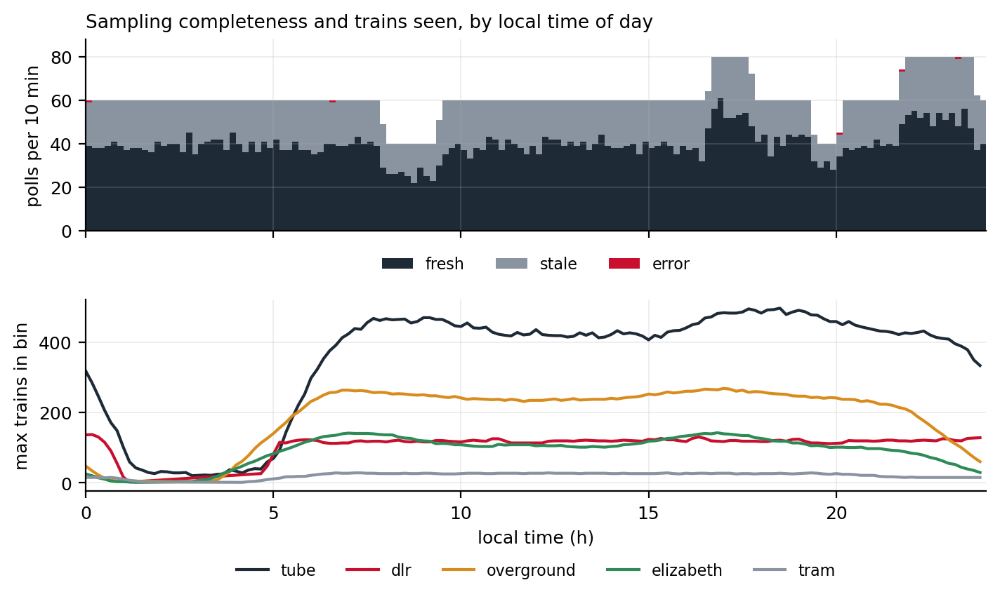
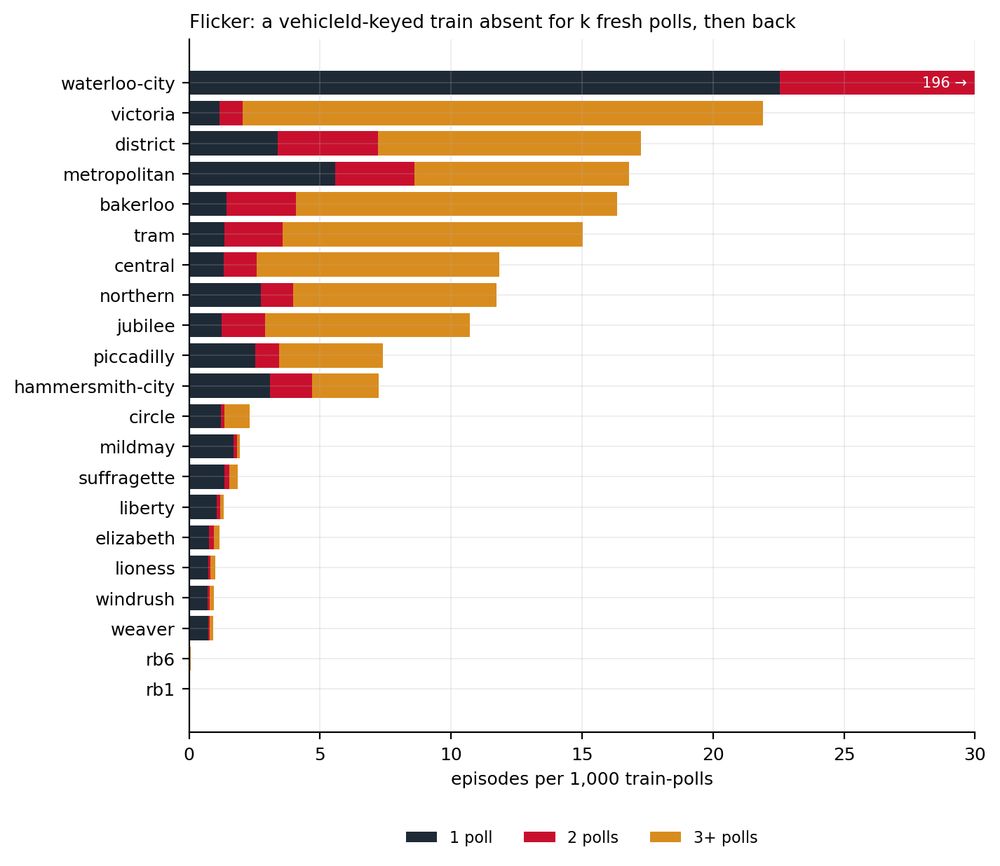
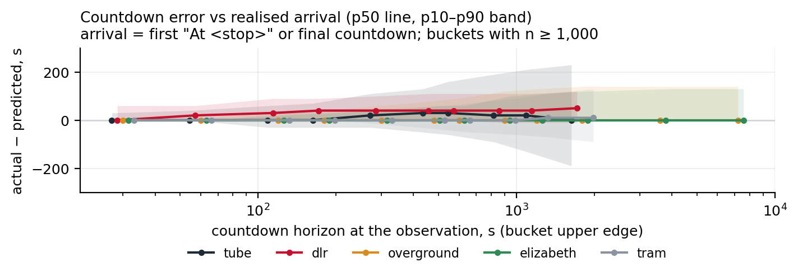

# Summary {.unnumbered}

- **The input is a countdown, not a coordinate.** TfL's Arrivals feed lists, per platform, each approaching train with its identifier (where one exists), its next stop, a free-text location and a time-to-station in seconds. Positions are inferred from the countdown and a baked track geometry: a train that is $t$ seconds from a stop whose approach takes $T$ seconds is placed a fraction $1 - t/T$ along the track into that stop.
- **Identity comes first.** One physical train appears as many rows (one per platform ahead), on several lines where lines share rolling stock, and sometimes without an identifier at all. Rows are collapsed to trains by a ladder of keys: the vehicle identifier, else the location text, else, for DLR, the leading edge of the echoed rows; and predictions further than {{t_const_RUN_HORIZON_S|int}} s ahead with no location are treated as timetable, not observation.
- **The feed is noisy in known ways, and each rule answers one of them.** Over {{t_days}} days of samples, {{t_tube_regress_pct}}% of consecutive tube countdown pairs went backwards and tube countdowns moved in 30 s steps rather than ticking; {{arr_stale_pct}}% of polls brought nothing new; identified tube trains vanished and returned at a rate of {{arr_tube_flicker_per1000}} per 1,000 train-polls; sub-surface lines listed the same train on more than one line in {{arr_sub_dup_pct}}% of rows; and only the tube lines carry a location text at all. Monotonic progress, countdown blending, 60 s retention and cross-line de-duplication are the responses.
- **Run times are the quantity the model has to assume.** Where TfL's timetable gives a scheduled run time the segment uses it plus a 30 s dwell allowance; where it does not, which is every Overground and Elizabeth line segment, a 12 m/s fallback clamped to 45 to 300 s. The countdown measured at the first poll after a departure, {{arr_tube_dep_tts_p50|int}} s at the median across the tube, is consistent with the allowance.
- **The display is where smoothness comes from.** Positions are recomputed every poll; between polls the train is dead-reckoned along its track at the rate the countdown implies, eased with a 4 s time constant, and never moved backwards within its segment. An identified train the feed drops is coasted for 60 s before it is removed; an unidentified one is handed to its successor or dropped at once.
- **National Rail uses the same idea on different data.** Darwin departure boards give calling points with times rather than countdowns, so a service is placed by the clock between its last and next calling point along a baked station graph, with no display smoothing. It is coarser, and the document says where.
- **What cannot be claimed.** No position ground truth exists, so accuracy is stated as consistency between what the feed said earlier and what it said later, with the sampling bias of a 30 s recorder made explicit.

# Scope and notation {#sec-scope}

This is the third of three technical notes on London Live. The first describes bus GPS processing; the second the system's architecture and load. This one describes the train side: everything between a prediction row leaving TfL's API and a train icon moving on the map, for the eleven Underground lines, the DLR, the six Overground lines, the Elizabeth line, trams, the cable car and the river services that TfL's feed covers, and separately for National Rail.

The body is written as rules with reasons. Each rule is stated with its value, the failure it answers, and, where one exists, the measurement that justifies the value. Values are collected in Appendix A with the file they live in; measurements in Appendix B with the days they were taken and the commit of the application they describe. The analysis scripts, the recorder and the number pipeline are described in @sec-repro so that every figure can be regenerated from the recorded samples.

| Symbol | Meaning |
|---|---|
| $t$ | timeToStation: the feed's countdown to the train's next stop, seconds |
| $T$ | run time assumed for the track segment into that stop, seconds |
| $f$ | fraction of the segment's length the train is placed at, $0$ at the previous stop, $1$ at the next |
| $H$ | horizon beyond which a location-less prediction is treated as timetable ({{t_const_RUN_HORIZON_S|int}} s) |
| $t_{plat}$ | countdown at or below which a train is placed at the platform ({{t_const_AT_PLATFORM_S|int}} s) |
| $\tau$ | easing time constant of the display (4 s) |

: Notation. {#tbl-notation}

# The data source {#sec-feed}

## What TfL publishes {#sec-feed-what}

The Unified API's Arrivals endpoint [@tflapi] answers, for a line or a list of lines, with one row per (train, platform) pair: every platform the train is expected to call at next, with the seconds until it does. A row carries the line, the stop (a NaPTAN identifier and a name), the platform, the direction, the destination, a `towards` text, a `vehicleId`, a `currentLocation` text, a `timeToStation` in seconds, an expected arrival time and a `timestamp`. It carries no coordinates. The rows are TfL's own predictions, driven by the signalling systems; the feed is a view of what the prediction engine currently believes, not a log of train movements, and @sec-feed-dynamics measures how often that view changes.

Three properties of the rows matter for everything that follows and are measured in this section. The `vehicleId` is present and stable on most lines, absent on the DLR, and placeholder `000` on a fraction of rows elsewhere. The `currentLocation` is free text written by the line's own system, in a vocabulary that differs by line. And the `timestamp` is per response, not per row: it says when the body was generated, and a body re-served from a cache keeps it.

## How the map fetches it {#sec-feed-fetch}

The browser polls one backend route, `/api/arrivals`, for all 25 line identifiers in the manifest every 10 s; the backend answers from an 8 s cache and fetches from TfL on a miss, so however many tabs are open the origin fetches at most once per 8 s, and the leaderboard sampler keeps a floor of one fetch per 15 s when no tab is open (the second document covers the budgets). A fetch returns {{t_rows_per_poll|int}} rows on average over the sample, nights included, about 7 MB decoded (the second document measures the bodies), and the browser reads eleven of the twenty-odd fields on each.

## The recorded sample {#sec-feed-sample}

Everything measured in this document comes from a recorder that polled the same route every 30 s and kept eleven fields per row, those the inference reads (with the destination as its stop identifier rather than its name) plus the row identifier and the response timestamp, each poll as its own compressed record. The sample covers {{t_days}} UTC days, {{t_day_first}} to {{t_day_last}}: {{t_polls|int}} polls, {{t_rows_total|int}} rows, with hourly coverage of {{t_coverage_days}} (@fig-coverage). {{arr_stale_pct}}% of polls brought nothing new for any line. Counted per line and poll, {{arr_ts_same_pct}}% carried the same TfL `timestamp` as the previous poll, the backend's cache replaying a body, and {{arr_ts_back_pct}}% carried a timestamp *older* than one already seen, which an 8 s cache cannot do and which points at the edge cache in front of the origin serving a copy it held while the origin had moved on. Both kinds are excluded from every comparison between consecutive polls, so the effective cadence of fresh bodies is {{arr_ts_interval_p50|int}} s at the median and {{arr_ts_interval_p90|int}} s at the 90th percentile, and the data age at the moment of a poll (poll time minus TfL timestamp) is {{arr_age_p50|int}} s at the median and {{arr_age_p90|int}} s at the 90th percentile. The sampler itself missed {{arr_sampler_gap_h}} hours in {{arr_sampler_gaps}} gaps, one of them a morning and one an evening peak.

{#fig-coverage width=100%}

Three biases of the recorder must be read into every number below. It polls every 30 s, and sees a fresh body only every {{arr_fwd_interval_mean_s|int}} s on average, where the map polls every 10 s; so any change that reverses itself within that interval is invisible: counts of regressions and flickers are lower bounds, and a one-poll absence here is a 30 s absence on the map's scale. And arrival events are observed at poll granularity, so any "time at arrival" carries up to one poll of quantisation. The map adds a bias of its own: it dead-reckons from the moment it received a body, not from the body's TfL timestamp, so the data age of {{arr_age_p50|int}} s at the median puts a moving train about 130 m behind where the feed's clock would, at 12 m/s.

## What a row looks like, by mode {#sec-feed-modes}

The feed is one endpoint but four different feeds in behaviour (@tbl-modes).

| Mode | Lines | Trains per poll | Identifier | Location text | Horizon |
|---|---|---|---|---|---|
| Tube | 11 | {{t_tube_trains_per_poll|int}} trains | present; `000` on {{t_tube_vid_missing_pct}}% of rows (Metropolitan {{arr_met_vid000_pct}}%) | present, line-specific | live; first seen {{t_northern_first_tts_p50|int}} s ahead (Northern median) |
| DLR | 1 | {{t_dlr_leads_per_poll|int}} leading edges | absent on every row | absent | echoed at every platform ahead |
| Overground | 6 | {{t_overground_trains_per_poll|int}} identifiers (per trip, more than the fleet) | present on every row | absent | {{t_overground_tt_pct}}% of rows beyond the horizon |
| Elizabeth | 1 | {{t_elizabeth_trains_per_poll|int}} identifiers (per trip) | present on every row | absent | {{t_elizabeth_tt_pct}}% beyond the horizon; first seen {{arr_elizabeth_first_tts_p50|int}} s ahead |

: The four behaviours of one feed, measured over the sample ({{t_day_first}} to {{t_day_last}}). Overground and Elizabeth identifiers outnumber the fleets, so they identify trips rather than train sets. {#tbl-modes}

Only the tube lines carry a location text; on the DLR, the Overground and the Elizabeth line the field is empty on every row, so every rule in this document that reads it is a tube rule. On the tube the vocabulary is where the lines differ: @fig-vocab shows, per line, the share of rows whose location starts "At", "Approaching", "Between", "Left", a sidings or depot phrase, or something else. The Northern line writes "Departed X"; the Jubilee "Leaving X"; the Bakerloo "North of X" and "South of X"; and spelling varies ("Plaform", "Kings Cross P7"). The prefixes the inference recognises are a design decision discussed in @sec-arms, and the share it does not recognise is measured there.

{#fig-vocab width=100%}

The sub-surface lines (District, Circle, Hammersmith & City, Metropolitan) share rolling stock and track, and TfL lists one physical train under each line it can be assigned to: {{arr_sub_dup_pct}}% of their identified listings are such cross-line duplicates, and every frequent pairing involves the Hammersmith & City line ({{t_sub_top_pairs}}). The six Overground lines show the same at a lower rate, {{arr_og_dup_pct}}%, all of it Mildmay with Windrush.

The DLR is the odd one out. Its rows carry neither an identifier nor a location, and each train is listed against every platform ahead of it, so one train produces {{arr_dlr_rows_per_train}} rows per poll on average at {{arr_dlr_rows_per_lead}} distinct platforms; only the leading one, the first platform ahead, says where it is.

Overground and Elizabeth rows carry an identifier on every row, but the feed reaches far into the timetable: {{t_elizabeth_tt_pct}}% of Elizabeth rows are predictions more than {{t_const_RUN_HORIZON_S|int}} s out, for trains that may not have left their origin, and a train first appears at a median horizon of {{arr_elizabeth_first_tts_p50|int}} s on the Elizabeth line against {{t_northern_first_tts_p50|int}} s on the Northern.

## How the countdown behaves {#sec-feed-dynamics}

The countdown is the quantity everything is computed from, so its dynamics are the first measurement. For every identified train and platform, consecutive fresh polls give a pair $(t_{prev}, t_{new})$ separated by an elapsed time $e$ from the TfL timestamps; the residual $r = t_{prev} - e - t_{new}$ is zero if the countdown ran down exactly with the clock, positive if it jumped ahead, negative if it was pushed back.

{#fig-residual width=100%}

@fig-residual gives the distribution. On the tube the residual is {{t_tube_residual_p50|int}} s at the median but {{t_tube_residual_p10|int}} s at the 10th and {{t_tube_residual_p90|int}} s at the 90th percentile over {{t_tube_residual_n|int}} pairs; {{t_tube_regress_pct}}% of pairs regressed (the countdown went up) and {{t_tube_stall_pct}}% stalled (it did not fall by at least the elapsed time). The shape of the distribution says more than the tails: {{arr_tube_resid_zero_pct}}% of tube pairs sit at zero, {{arr_tube_resid_lobe30_pct}}% at ±30 s and {{arr_tube_resid_lobe60_pct}}% at ±60 s, multiples of the recorder's step. A tube countdown does not tick with the response timestamp; it holds for a step and then catches up, so most of what the stall share counts is this stepping rather than trains held at signals. The DLR, whose countdowns are issued at a fixed spacing rather than measured, steps the same way ({{arr_dlr_resid_p10|int}} to {{arr_dlr_resid_p90|int}} s), with {{arr_dlr_regress_pct}}% of pairs regressing. One caution: the steps are the size of the recorder's own interval, and a recording at the map's 10 s cadence is needed to rule out that the step is partly an artefact of sampling. The Overground and Elizabeth lines do the opposite: {{arr_overground_resid_zero_pct}}% of their pairs have a residual of exactly zero, the countdown is a clock, and the display rules that absorb oscillation are no-ops there. These are the dynamics the display's blending (@sec-display) is sized against.

Identified trains also vanish and reappear. @fig-flicker counts, per 1,000 train-polls, a train absent for one fresh poll and back the next, for two, and for three or more: on the tube {{arr_tube_flicker_per1000}} episodes per 1,000 train-polls, of which {{arr_tube_flicker_gap3plus_share_pct}}% last three polls or longer; on the Overground {{arr_overground_flicker_per1000}}, mostly one poll; on the Waterloo & City line, whose two-stop shuttle is listed and delisted at each end, {{arr_wc_flicker_per1000}}. At the recorder's cadence a one-poll absence is already a 46 to 92 s gap, longer than the display's 60 s retention; the map, polling at 10 s, sees the one- and two-poll absences of 10 to 20 s that the recorder cannot, and those are what the retention rule of @sec-display answers. The long absences here are trains the feed has lost for minutes, and the right response to those is to let them go, which the same rule does after 60 s.

{#fig-flicker width=100%}

# Baked geometry {#sec-geometry}

Positions are fractions along track segments, so the segments are the second input. They are baked offline and committed; the running system never asks TfL or OpenStreetMap for geometry.

## Branches, stops and segments {#sec-geometry-branches}

For each line and direction, TfL's Route Sequence endpoint gives one or more stop-point sequences (branches) and line strings. A branch file holds, per direction, the ordered stops with coordinates, one track segment per consecutive stop pair, and, where available, a scheduled run time per segment. The stops are authoritative and never changed by later bakers; the segments are.

The first baker cuts each segment from TfL's own line strings, projecting the two stops onto every line string and keeping the sub-polyline between them where both snap within 250 m and the path is no more than four times the straight-line distance; failing that, a straight chord. River routes are cut along the OpenStreetMap Thames centreline instead, with curved pier approaches, because TfL's river geometry is pier-to-pier chords across the city.

The second baker replaces the segments of the 19 rail lines with real track from OpenStreetMap's route relations [@osm]: ways are stitched into chains that break at junctions, and each stop pair is cut from the chain that fits, then from a shortest path over the way graph if no single chain spans the pair, and only then kept as the TfL segment. The chain is chosen by snap distance alone, so where a line runs in twin bores or on double track (8 to 31 m apart, measured over the OpenStreetMap ways of the 19 lines) inbound and outbound trains share whichever bore snapped better and can hop between bores at a station, which is visible at street zoom. A revision under review at the time of writing gives each direction its own track: a chain whose OpenStreetMap tags say trains run the other way is never used while an alternative exists, among untagged parallel tracks the left-most in the direction of travel is taken, as UK trains keep left, and consecutive segments prefer to stay on one track.

The inventory is {{t_geo_lines}} line files, {{t_geo_segments|int}} direction-segments and {{t_geo_km|int}} km of direction-track (@tbl-geometry, computed from the committed files at application commit `{{t_app_commit}}`).

| Mode | Lines | Geometry source | Physical branches | Route km (one direction) |
|---|---|---|---|---|
| Tube | {{t_geo_tube_lines}} | OpenStreetMap subway relations | {{t_geo_tube_branches}} | {{t_geo_tube_km}} |
| DLR | {{t_geo_dlr_lines}} | OpenStreetMap light-rail relation | {{t_geo_dlr_branches}} | {{t_geo_dlr_km}} |
| Elizabeth line | {{t_geo_elizabeth_line_lines}} | OpenStreetMap train relation | {{t_geo_elizabeth_line_branches}} | {{t_geo_elizabeth_line_km}} |
| Overground | {{t_geo_overground_lines}} | OpenStreetMap train relations | {{t_geo_overground_branches}} | {{t_geo_overground_km}} |
| Trams | {{t_geo_tram_lines}} | TfL line strings (16 of 54 segments are chords) | {{t_geo_tram_branches}} | {{t_geo_tram_km}} |
| Cable car | {{t_geo_cable_car_lines}} | TfL line string | {{t_geo_cable_car_branches}} | {{t_geo_cable_car_km}} |
| River services | {{t_geo_river_bus_lines}} | OpenStreetMap Thames centreline with pier approaches (ferry: TfL) | {{t_geo_river_bus_branches}} | {{t_geo_river_bus_km}} |
| National Rail | graph | OpenStreetMap main-line ways, station-to-station | {{t_nr_segments}} segments | {{t_nr_km|int}} |

: What the trains are drawn on, from the committed branch files. Branches are the outbound stop sequences per line; a branch file holds each in both directions. {#tbl-geometry}

## Run times {#sec-geometry-runtimes}

The third baker walks TfL's Timetable endpoint from each branch's first stop and records, per ordered stop pair, the median of the scheduled intervals between consecutive stops. The result is a run time in seconds per segment, present for {{t_geo_runtime_pct}}% of segments ({{t_geo_runtime_filled|int}} of {{t_geo_segments|int}}). The gap is structural: the Timetable endpoint does not answer for the Elizabeth line and the six Overground lines under their current identifiers, so none of their segments has a scheduled time and every train on those lines is placed by the geometric estimate of @sec-runtime; the other {{t_geo_fallback_segments}} fallback segments are those lines plus three elsewhere. A baker that derives run times from the recorded Arrivals sample itself, as the median difference between a train's countdowns to two consecutive stops within one poll, exists and awaits review; the second document's calibration found its values within a minute of the timetable's where both exist.

## The National Rail graph {#sec-geometry-nr}

National Rail has no branch files. A separate baker snaps {{t_nr_stations}} stations inside the London box to the nearest OpenStreetMap main-line track node, assigns every node within 300 m of a station to that station's zone, and runs one shortest-path search per station that may enter a foreign zone but not leave it; the cheapest node reached in each foreign zone defines a neighbour and the path to it a segment. The result is {{t_nr_segments}} undirected segments, {{t_nr_km|int}} km, with a polyline each and no timing (commit `{{t_app_commit}}`). Adjacency is geometric, not timetable topology: some station pairs that a real service runs between non-stop exist only as a chain of segments, which is what the pathing of @sec-nr walks.

# Identity: from rows to trains {#sec-identity}

A poll is a list of rows; the map needs a list of trains. The resolution is a pure function of one poll and the previous poll's assignments, and it runs in the browser (and, for the leaderboard, once on the server).

## Cross-line de-duplication {#sec-identity-stock}

Lines that share stock are grouped: the four sub-surface lines form one identifier namespace, the six Overground lines another. Within a group, rows with the same `vehicleId` on different lines are one train, and the listing with the smallest countdown is kept, on the reasoning that the line whose platform the train is nearest is the line it is currently running as. The measured margin says this is usually clear and sometimes a tie: when a sub-surface train is listed on two lines, the second-smallest countdown exceeds the smallest by {{arr_sub_margin_p50|int}} s at the median, but by {{t_sub_margin_p10|int}} s at the 10th percentile, so for about a tenth of duplicates the two listings agree on the countdown and the line is decided by the order of the rows.

## The key ladder {#sec-identity-ladder}

After de-duplication each row is keyed, in order of preference:

1. `line:vehicleId`, when the identifier is present and not the placeholder `000`. This is the common case on the tube, the Overground and the Elizabeth line.
2. `line|currentLocation`, when there is no identifier but there is a location text: rows at every platform ahead of the same unidentified train carry the same location, so the text is a serviceable identity for as long as it does not change. Where the same text appears for two directions it is split by direction. On the Metropolitan line, the one line where this level carries weight ({{arr_met_loc_key_pct}}% of its rows), a synthetic identity lives {{arr_met_loc_life_p50|int}} polls at the median, because the text moves with the train ("Between A and B" becomes "Between B and C"); @sec-display describes the hand-over that keeps the icon continuous across the change.
3. The DLR leading edge, when there is neither: rows are grouped by direction, destination and stop, and only the row not echoed by an earlier stop on the same chain is kept, using the baked stop order to know which stops are earlier. {{t_dlr_rows_le_h_pct}}% of DLR rows are within the horizon and {{t_dlr_leads_per_poll|int}} leading edges per poll survive.
4. A timetable key, `line:tt:destination:stop`, for rows with neither identifier nor location, kept only if the countdown is within $H$ = {{t_const_RUN_HORIZON_S|int}} s. Beyond that a location-less prediction is the timetable, not an observation, and is dropped rather than drawn.

The ladder's levels are not equally trustworthy, and the leaderboard, which turns positions into distances, credits only level 1: a synthetic identity that hands over to another would otherwise invent distance.

Two details of level 1 were learned from the feed rather than designed. The placeholder `000` is what some lines' systems write when a train has not yet been assigned a set number, most often at a terminus before departure and on the Metropolitan line generally; treating it as an identifier would merge every such train on the line into one, so it is treated as absent and the row falls to level 2. And a terminus train is listed twice at one platform, once as the arrival and once as the following departure, with the same identifier and different countdowns; the row with the smaller countdown is the train's current state and the other is discarded with the rest of its rows.

A worked poll makes the ladder concrete, on the line where every level is exercised. A Metropolitan line body contains, among others: inbound rows for set 061 at Northwick Park (40 s), Preston Road (150 s) and Wembley Park (280 s), all with the text "Between Harrow-on-the-Hill and Northwick Park"; rows with `000` at Aldgate reading "At Aldgate Platform 3" with countdowns of 0, 420 and 900 s; and a row at Finchley Road with `000` and "Approaching Finchley Road". Set 061 is one train, keyed by its identifier, placed by the Northwick Park row, and its two further rows are kept only for the hand-off. The three `000` rows at Aldgate share a text and would, taken literally, become one synthetic train at the platform; they are in fact the three next departures the system has not numbered yet, and the ladder's inability to tell them apart is the price of a placeholder identifier: at a terminus the feed, not the inference, decides what is drawn. The Finchley Road row keys a synthetic train "Approaching Finchley Road", which the display will hand over to the train born as "At Finchley Road" in a later poll if the two positions are within 300 m, as they are.

## The horizon {#sec-identity-horizon}

$H$ matters most on the Overground and Elizabeth lines, where the feed is timetable-reaching: a train is listed at platforms it will reach in an hour, with an identifier, before it has left its origin. Those rows carry an identifier, so the ladder would key them, and the horizon is therefore also applied to identified trains that have no location text: a train whose nearest platform is more than $H$ ahead and that says nothing about where it is, is not drawn. On the sample {{arr_elizabeth_undeparted_pct}}% of Elizabeth and {{arr_overground_undeparted_pct}}% of Overground train-observations are beyond the horizon at their nearest platform with no location, and are not drawn; what is left is the trains actually between stations. Whether {{t_const_RUN_HORIZON_S|int}} s is the right value cannot be decided from the feed alone: a shorter horizon would hide a train that has in fact departed, a longer one would draw a train still in the depot, and only a position source could tell the two apart.

## One train, one stop {#sec-identity-nearest}

A keyed train still has one row per platform ahead. The row with the smallest countdown is the train's next stop, and it is the only row used for positioning; the others are kept per stop for the hand-off of @sec-handoff.

# Position on the branch {#sec-position}

## Choosing the branch {#sec-position-branch}

The next stop's identifier locates the train on every branch, in the given direction, that contains that stop. Where there is more than one (every line with a junction), the choice is: the branch the train was on at the previous poll, if it is still a candidate, so that prediction jitter never teleports a train between branches; otherwise a branch whose last stop matches the train's destination; otherwise a branch where the stop is mid-sequence rather than at index zero, because a train "approaching" a terminus's first stop is usually on the branch where that stop is en route.

Camden Town is the hard case: the Charing Cross and Bank branches converge there from the south and the Edgware and High Barnet branches leave to the north, and the branch files split at the junction, so a northbound train whose next stop is Camden Town is a candidate on four branches, two of which have Camden Town as their first stop. A train that was already on a branch keeps it. A new train is matched by its destination to a northern branch, on which Camden Town is the first stop and the dwelling arm applies until the hand-off; a new train whose destination matches no branch end, such as a Bank-branch train terminating short, falls to the mid-branch rule and the first candidate. The possible errors are confined to the first poll a train is seen at a junction, and hysteresis then keeps whatever was chosen, right or wrong, until the next stop settles it; the second document's leaderboard, which runs the same code, is the consumer most exposed to this.

## The ratio model {#sec-ratio}

With a branch and a next stop at index $i$, the train is on the segment from stop $i-1$ to stop $i$. Given the countdown $t$ and a run time $T$ for that segment,

$$ f = 1 - \min\!\left(1, \frac{t}{T}\right) $$ {#eq-ratio}

and the train is drawn at the point a fraction $f$ along the segment's arc length, facing along it. The model assumes uniform speed over the segment and that the countdown is the time to the platform; both are false in detail and good enough in sum, for two reasons. The countdown is re-read every poll, so an error in $T$ is a transient error in position that corrects as $t$ falls to zero at the platform, and the display never lets $f$ decrease, so the correction is always a catch-up, never a retreat.

{#fig-ratio width=100%}

## The run time {#sec-runtime}

$T$ is the one quantity the model has to assume. Where the segment has a scheduled run time $s \ge 20$ s, $T = \min(300, s + 30)$. The 30 s is a dwell allowance: TfL's timetable intervals are whole minutes and exclude the dwell at the departure platform, so the raw scheduled figure systematically undershoots the countdown a train actually shows when it leaves. The allowance was set from a probe recorded in the code (a 60 s scheduled interval against 74 to 89 s observed), and the sample is consistent with it: at the first fresh poll after a tube train's location says it has left a stop, its countdown to the next is {{arr_tube_dep_tts_p50|int}} s at the median across the tube ({{arr_tube_dep_tts_p90|int}} s at the 90th percentile, {{arr_tube_dep_tts_n|int}} departures), {{t_northern_dep_tts_p50|int}} s on the Northern line, {{t_victoria_dep_tts_p50|int}} s on the Victoria and {{t_central_dep_tts_p50|int}} s on the Central, against scheduled intervals of one to three minutes. The recorder sees the first poll *after* the departure, up to 46 s late, so the countdown at the moment of departure is larger than measured, and the allowance is if anything on the small side. A per-segment comparison of these countdowns with each segment's scheduled time is the test that would settle the value, and it is left for a later revision.

Where there is no scheduled time, $T$ is the segment's length at 12 m/s, clamped to 45 to 300 s. The speed and the clamps carry no measurement behind them; they are a prior, and at the time of writing it is the prior every Overground and Elizabeth line train is placed by ({{t_geo_fallback_segments}} segments, @sec-geometry-runtimes). On those lines the countdown is itself a timetable clock (@sec-feed-dynamics) and there is no location text, so their trains are drawn on time along a guessed speed: a delayed Overground train is drawn where it should be, not where it is, until its countdown is re-issued.

The DLR is a special case of the countdown rather than of the model. Its countdowns are issued at a fixed spacing (the next trains on a platform are listed at 149, 449, 749 s and so on) and then step down like the tube's, so they are a schedule re-issued at intervals, not a measurement. The ratio model still places the leading edge plausibly, because the schedule is kept, but a DLR train that is held at a signal is drawn moving until the countdown is re-issued, and the sample shows DLR trains arriving {{arr_dlr_acc300_p50|int}} s later than their countdown said at the median (@sec-accuracy).

Two guards act on $T$. If the location text proves the train has left its previous stop ("Between", "Left") and the countdown plus a 20 s margin exceeds $T$, then $T$ is wrong rather than the countdown, and it is stretched to $t + 20$ s so that the ratio stays just past the platform and keeps advancing. And a countdown of $t_{plat}$ = {{t_const_AT_PLATFORM_S|int}} s or less places the train at the platform, $f = 1$, whatever $T$ is.

## The location arms {#sec-arms}

The location text is used in three ways, each for the train's own next stop only. "At X", where X is the next stop, places the train at the platform. "Approaching X" clamps $f$ to at least 0.85. "Between" or "Left" are the departure proof of the stretch above. The restriction to the own next stop was learned from a failure: a train listed at Liverpool Street with the text "At Aldgate Platform" is a terminus dwell of a different listing, and snapping on it made trains jump.

The clamp was learned from another. On the Metropolitan line the countdown freezes 45 to 60 s stale while the train is already at or near the platform, and the text, which comes from the signalling system directly, is ahead of it. The sample quantifies the lag the clamp absorbs, in both directions. When a tube train's text says it is approaching its own next stop, its countdown is {{arr_tube_app_own_p50|int}} s at the median and {{arr_tube_app_own_p90|int}} s at the 90th percentile ({{arr_tube_app_own_n|int}} rows), {{t_metropolitan_app_own_p50|int}} s on the Metropolitan, where the clamp implies about 15% of a segment, or 20 to 40 s at line speed. Conversely, among rows whose countdown is at or below {{t_const_AT_PLATFORM_S|int}} s, only {{arr_tube_near_at_own_pct}}% say "At" the stop in question; {{arr_tube_near_between_pct}}% still say "Between" and {{arr_tube_near_at_other_pct}}% say "At" some other stop. The text lags the countdown as often as it leads it, which is why the at-platform arm is driven by the countdown and the text is only allowed to pull a train forward, never back.

What the arms do not read is measured too, and here the sample contradicts the code. The departure proof recognises "Between" and "Left", but the Northern line writes "Departed X", the Jubilee "Leaving X" and the Bakerloo "North of X" or "South of X": {{arr_tube_departed_missed_pct}}% of all tube departures in the sample carried a text that proved the departure and was not recognised, {{arr_northern_departed_missed_pct}}% on the Northern line, {{arr_jubilee_departed_missed_pct}}% on the Jubilee and {{arr_victoria_departed_missed_pct}}% on the Victoria. The cost arises when such a train's countdown exceeds the segment's run time: it is pinned at the platform it has left until the countdown falls below the run time. The fix is not quite three words, because "North of" and "South of" prove a departure only given the direction of travel and the Victoria line also writes "Departing X"; it needs a per-line vocabulary, and it is listed in @sec-limits. The remaining "other" class in @fig-vocab is small ({{t_northern_loc_other_pct}}% on the Northern line) and is mostly named places that are not stops: {{t_northern_other_loc_top}}.

## The hand-off at the platform {#sec-handoff}

When a train is at its next stop, by countdown or by text, and that stop is not the end of the branch, the feed often keeps a stale row at that stop for a poll or two after the train has gone, which would pin the icon there. So once at the platform the train is positioned by the freshest row at the successor stop instead, if one exists for the same train, and it starts along the next segment as that countdown falls. The stale row is visible in the sample as the "At own stop" rows whose countdown is still large: {{arr_tube_at_own_over_pct}}% of them show 300 s or more, and on the Hammersmith & City line {{arr_hammersmith_city_at_own_over300_pct}}% do, most plausibly terminus departures listed as already at the platform (the stations involved have not yet been checked). @fig-consistency gives the countdown distributions behind these three arms.

{#fig-consistency width=100%}

## What the countdown can promise {#sec-accuracy}

The ratio model's position error is the countdown's error scaled by the segment. The sample measures the countdown's error directly: for each train and stop, the countdown read at a horizon of $h$ seconds is compared with the time the train was then observed to arrive, where arrival is the first poll whose text says "At <that stop>" or, failing that, the last poll whose countdown was 45 s or less; tracks with neither are censored and counted. @fig-accuracy gives the error by horizon bucket.

{#fig-accuracy width=100%}

On the tube a countdown read within 120 s of arrival is {{arr_tube_acc120_p10|int}} to {{arr_tube_acc120_p90|int}} s wrong at the 10th to 90th percentile ({{arr_tube_acc120_p50|int}} s median, {{arr_tube_acc120_n|int}} readings); read within 300 s, {{arr_tube_acc300_p10|int}} to {{arr_tube_acc300_p90|int}} s, with the train late more often than early. At 12 m/s those errors are a few hundred metres within a segment and 0.7 to 1.3 km at the 90th percentile five minutes out, which is the resolution the map should be read at; the positive skew means a train drawn by the ratio model is, when wrong, usually drawn ahead of where it is. DLR trains arrive {{arr_dlr_acc300_p50|int}} s later than their fixed-spacing countdown said, at the median. The Overground and Elizabeth lines show an error of zero at the median at every horizon, which is circular rather than reassuring: their countdown is a clock, their arrival is detected from that same clock, and neither says where the train is. The arrival rule on the tube is mostly the countdown too: only {{arr_tube_arrival_at_pct}}% of tube arrivals were pinned by an "At" text, and {{arr_tube_arrival_censored_pct}}% of tracks ended without an observed arrival (the train was dropped, or the sample ended), so the figure describes the half of the tracks that completed.

# Display {#sec-display}

Inference runs once per poll, every 10 s. The display runs every animation frame, with the map's rebuild gated to about 15 a second, and has to make a train move plausibly between two inferred positions that may disagree by the whole of the feed's noise. The interpolator holds, per train, the segment it is on, the fraction it is displayed at, the fraction the latest poll asked for, and a working countdown of its own.

## Blending the countdown {#sec-display-blend}

The polled position is taken at face value: the fraction the inference computed from the raw countdown is the new target. What is blended is the working countdown used between polls: the new countdown and the previous one advanced by the elapsed time, half and half, as long as the train is on the same segment, so that a 30 s step in the feed (@fig-residual) becomes a 15 s step in the rate at which the train is dead-reckoned.

## Forward only {#sec-display-forward}

Within a segment the displayed fraction never decreases. If a poll implies a smaller fraction than the one shown, the target is simply not moved; if it implies a larger one, the display eases toward it. A regression in the feed, {{t_tube_regress_pct}}% of tube pairs, therefore produces at worst a pause, never a train running backwards along its segment. When the train advances to a new segment, the displayed point is carried onto it by projection (the old segment's end is the new one's start) and the display continues from there, so a segment change is not a jump. The guarantee has three edges: a retarget of more than 1.5 km is treated as a re-identification and snapped; a segment change whose new next stop lies behind the carried point moves the train back; and a hand-over between synthetic identities starts from the successor's position.

## Dead reckoning between polls {#sec-display-dr}

Every frame, the countdown is extrapolated by the time since the poll, the fraction it implies is computed, and the target becomes the larger of the polled and the extrapolated fraction. The display then eases toward the target with $1 - e^{-\Delta t/\tau}$ per frame, $\tau$ = 4 s, so a train closes about two thirds of the gap to its target every four seconds and arrives at the platform as the countdown reaches zero rather than at the next poll. Dead reckoning is capped at the current segment's end: a train is never advanced into a segment the feed has not put it on.

## Absence, retention and succession {#sec-display-absence}

An identified train missing from a poll is not removed. It is coasted, with the dead reckoning above, for 60 s, and dropped only then; at the map's cadence that covers absences of a few polls. A train whose next stop is its destination and whose fraction is at least 0.97 is released after 12 s instead, because short workings end mid-line and the icon should not linger. A train in its last 10 s of retention fades. A synthetic identity gets no retention: when its key disappears, because its location text changed or, on the DLR, because the leading edge moved to the next platform, its display state is handed to an identity born in the same poll on the same line and direction whose position is within 300 m, and if there is none it is removed at once. On the DLR, where every train is re-keyed at every platform, the hand-over is the only thing that makes a train continuous.

## A poll, frame by frame {#sec-display-worked}

Take a Victoria line train that the 10:00:00 poll puts 90 s from Green Park on a segment whose run time is 120 s: $f = 0.25$. The display eases toward 0.25 and, each frame, also computes where the train would be if the countdown had simply run down, so by 10:00:08 the dead-reckoned target is $1 - 82/120 = 0.32$ and the icon is a little behind it, closing the gap at the easing rate. The 10:00:10 poll says 85 s: the polled target is $f = 0.29$, and the working countdown becomes the blend of 85 s with the previous 90 s advanced by 10 s, 82.5 s, so dead reckoning continues almost exactly where it was and the 5 s of feed noise is invisible. The 10:00:20 poll says 95 s, a regression: the polled target, $f = 0.21$, is behind the displayed fraction, so the target is left where it was and the icon pauses for a few seconds until the feed catches up with the display. The 10:01:30 poll says 12 s: the train is placed at the platform, $f = 1$, and because a successor row exists at Oxford Circus it is re-based on that countdown and starts along the next segment as it falls. Had the 10:01:30 poll not listed the train at all, nothing would change on screen for 60 s; the train would continue to dead-reckon along its segment and stop at its end.

The point of walking through this is that every rule of the section is a response to one thing the feed did in that minute: the oscillation, the regression, the stale platform row, the dropped poll. None of them is a smoothing choice made for appearance.

## Rendering {#sec-display-render}

Trains are one symbol layer whose data is rebuilt at most about 15 times a second (about 3 under the battery saver), with per-line icons rotated to the segment bearing and an opacity that fades an absent train out. A train that is clicked opens a card that follows it; the card reads the same interpolated state, so the position in the card and on the map never disagree. The rebuild budget this and the bus layers are held to, and why it is capped rather than run every frame, is the subject of the second document.

# National Rail {#sec-nr}

National Rail trains come from a different source and are placed by a different rule. The Darwin departure boards [@darwin] give, per station, the services due with their calling points and, for each calling point, the scheduled time and, once known, the estimated and the actual time. There is no countdown and no location text.

## Boards into timelines {#sec-nr-boards}

A departure board is a station's view: the services due to leave it in the next hour or two, each with its origin, destination, platform, operator, scheduled and estimated departure, and the full list of calling points ahead with a scheduled time and, once the train is running, an estimated or actual time for each. The map polls 17 hub stations, chosen so that their boards between them list most of the services that cross the London box: the termini, plus junction stations whose calling points cover the orbital and cross-London routes. One board is fetched every 4 s in rotation, so each is refreshed about every 70 s, through the same backend cache and budget that the second document describes.

Every service seen on any board is kept as one timeline keyed by its run identifier, which is stable for the day. A timeline is the ordered calling points with the best known time at each: the actual time where the board reports one, else the estimate, else the schedule. A service seen again from another board replaces its timeline only if the new sighting carries more calling points; otherwise the first sighting stands, times included. A delay that develops after a service was first seen is therefore not reflected until a fuller sighting replaces the timeline, which is the main source of error in this layer. Consecutive calling points that resolve to the same in-box station, which the gateway remapping below can produce, are collapsed so that no zero-length leg exists.

## Position by the clock {#sec-nr-clock}

A service is drawn when the clock lies between the times of two consecutive calling points $A$ and $B$ in its timeline:

$$ f = \frac{\text{now} - t_A}{t_B - t_A} $$ {#eq-nr}

along the shortest path from $A$ to $B$ on the station graph of @sec-geometry-nr, with the search capped at 60 km, its results cached (300 paths) and recomputed only when the timeline's calling points change. A service whose last calling point is more than two minutes in the past is pruned; one whose first calling point is still ahead is not yet drawn. There is no countdown, no location text and no display smoothing: the position is a pure function of the clock and the timeline, recomputed every frame.

## Gateways {#sec-nr-gateways}

One correction is needed for London in particular. A fast train leaves Euston and calls first at Milton Keynes, or leaves Paddington and calls first at Reading: both calling points lie outside the station graph, so the timeline has no in-box leg and the service would never be drawn while it is physically crossing twenty kilometres of visible track. For 28 such gateways the first out-of-box calling point is remapped to the outermost in-box station on that route (Kings Langley on the West Coast main line, Langley on the Great Western, Potters Bar, Radlett, Shenfield, Cheshunt, West Horndon, Denham Golf Club, West Byfleet, Clandon, Sevenoaks and Merstham on theirs), and the remapped point keeps the far calling point's time. The service is therefore drawn out to the edge of the map, but slowly: it reaches Kings Langley at the time it is due at Milton Keynes. This is a visibility fix, not a position estimate, and the document says so because a reader will see those trains crawl. The remap is a table, not a rule, and a new fast service pattern needs a new row.

## What it cannot do {#sec-nr-limits}

The result is coarser than the tube in three ways that the user can see. Positions are pure functions of the clock, so a train that falls late after its first sighting is drawn where the timetable says; a fuller sighting that replaces the timeline moves the train in a step; and the graph is geometric, so a non-stop service is drawn along the chain of station-to-station segments, which can differ from the line it actually takes through a junction. These are stated here rather than fixed because fixing them properly needs a position source: Network Rail's train-describer feed exists and is open, and adopting it is a different system from the one described here.

# Validation {#sec-validation}

There is no ground truth. TfL does not publish train positions, and the only public sources that do (the TD berth feed through Network Rail's open data, for National Rail) cover a different network. What can be measured is the feed's consistency with itself, and whether each rule's value sits where the measurement says it should. @tbl-validation lists the twelve measurements, the rule each one tests, and what the sample says.

| # | Measurement | Rule tested | Result on the sample |
|---|---|---|---|
| 1 | update cadence, stale share, data age | 10 s poll, 8 s cache, blending | {{arr_stale_pct}}% of polls nothing new ({{arr_ts_back_pct}}% older than seen); fresh body every {{arr_ts_interval_p50|int}} s median; age {{arr_age_p50|int}} s median |
| 2 | hourly coverage | completeness of the sample | {{t_hours_with_samples}} hour-cells across {{t_days}} weekdays, {{arr_sampler_gap_h}} h of gaps (@fig-coverage) |
| 3 | identifier missing or `000`, per line | the location fallback | tube {{t_tube_vid_missing_pct}}% of rows, Metropolitan {{arr_met_vid000_pct}}%, DLR 100%; justified, load-bearing on the Metropolitan only |
| 4 | location vocabulary by prefix | the three arms, the departure proof, the sidings rule | text empty on every non-tube mode; departure proof misses {{arr_tube_departed_missed_pct}}% of tube departures (contradicted) |
| 5 | countdown residual per mode | forward-only display, blending | tube {{t_tube_residual_p10|int}} to {{t_tube_residual_p90|int}} s (p10 to p90), {{t_tube_regress_pct}}% regress, steps of 30 s; Overground and Elizabeth {{arr_overground_resid_zero_pct}}% exactly zero |
| 6 | countdown error vs observed arrival by horizon | the ratio model's resolution | tube within 120 s: {{arr_tube_acc120_p10|int}} to {{arr_tube_acc120_p90|int}} s; within 300 s: {{arr_tube_acc300_p10|int}} to {{arr_tube_acc300_p90|int}} s; half of tracks censored (undecided) |
| 7 | flicker per 1,000 train-polls | 60 s retention, succession | tube {{arr_tube_flicker_per1000}} per 1,000, {{arr_tube_flicker_gap3plus_share_pct}}% of them three polls or longer; the need is shown, the value is not decidable at this cadence |
| 8 | cross-line duplicate rate and margin | stock-group de-duplication | sub-surface {{arr_sub_dup_pct}}% of listings, all through Hammersmith & City; margin {{arr_sub_margin_p50|int}} s median (justified) |
| 9 | DLR rows per train | leading-edge rule | {{arr_dlr_rows_per_train}} rows per train; without the rule about three dots per train (justified) |
| 10 | timetable-horizon share, first-appearance horizon | $H$ = {{t_const_RUN_HORIZON_S|int}} s | Elizabeth {{arr_elizabeth_undeparted_pct}}% and Overground {{arr_overground_undeparted_pct}}% of observations beyond $H$ without location; the need is shown, the value undecided |
| 11 | countdown while "At own", "Approaching own", at departure | at-platform, clamp, dwell allowance | at $\le$ 15 s only {{arr_tube_near_at_own_pct}}% of texts say "At own" (countdown arm justified); approaching {{arr_tube_app_own_p50|int}} s median (clamp value undecided); departure countdown {{arr_tube_dep_tts_p50|int}} s median (allowance consistent) |
| 12 | identity stability: key kinds, key lifetime, TfL id churn | synthetic identities, succession | identifier keys cover at least 98.8% of rows on every tube line but the Metropolitan ({{arr_met_loc_key_pct}}% location-keyed, living {{arr_met_loc_life_p50|int}} polls) |

: The twelve self-consistency measurements and what they found. Each is a script output; the per-line tables are in the data directory. {#tbl-validation}

Read as a whole, the sample justifies the need for every rule and the value of most, leaves three values undecided, and contradicts one. The undecided values are those a consistency check cannot reach: the 60 s retention (the recorder cannot resolve absences shorter than its own cadence), the {{t_const_RUN_HORIZON_S|int}} s horizon (only a position source can say whether a train listed 500 s out has left its depot) and the 0.85 clamp. The contradicted rule is the departure vocabulary: the lines that write "North of", "South of", "Departed" or "Leaving" are proved departed by the text and not recognised as such, {{arr_tube_departed_missed_pct}}% of tube departures. Two things the sample found were not being tested for at all: that the countdown on the tube and the DLR moves in 30 s steps, which makes the display's blending and dead reckoning more important than a smooth countdown would, and that a tenth of polls carry a body older than one already seen, which is a property of the serving path rather than of the feed and is handed to the second document's list of things to bound.

The figures of this document are read, in validation terms, as follows. @fig-coverage is the denominator: which hours the other figures speak for. @fig-vocab and @tbl-modes establish which rules apply to which lines at all, and the empty location field on three of the four modes is the single most consequential fact for anyone reusing this design on another network. @fig-residual sizes the display's smoothing: a blend of one half over a step of 30 s halves a 30 s jump, and the easing spreads what remains over 4 s, which is why a stepped countdown produces a train that moves in surges rather than one that stands still. @fig-flicker sizes the retention: the one- and two-poll absences the rule is for are the minority, and a 60 s window covers them; the three-poll-and-longer majority are not flicker but loss, and no retention value short of minutes would hold them. @fig-accuracy bounds the ratio model: within a segment the countdown is right to a few tens of seconds nine times in ten, which at 12 m/s is a few hundred metres, and that is the honest resolution of a tube icon. @fig-consistency and the near-platform mix are the arms' justification: at the moment the countdown says platform, the text agrees in only {{arr_tube_near_at_own_pct}}% of rows and names somewhere else in most of the rest, which is why neither is trusted alone.

The three biases of the recorder are quantified rather than assumed. Its effective fresh cadence is {{arr_fwd_interval_mean_s|int}} s, not 30, so every per-poll rate above is per 46 s of feed time; a change that reverses within that window is unseen, so regression and flicker counts are floors. Replays and older bodies are {{arr_stale_pct}}% of polls and are excluded, which shrinks pair counts but does not bias residuals, because elapsed time is taken from the feed's own timestamps. And arrivals are resolved to one poll, so the accuracy figure carries a floor of about half a poll of quantisation and is conditioned on the half of tube tracks that completed.

What a validation against truth would need is also clear. For the tube, TfL's internal track-circuit data, or the Trackernet feed that preceded the Unified API and reported berth occupancy; for National Rail, Network Rail's open train-describer feed. Either would turn @fig-accuracy from a consistency check into an error measurement. Until then the figures of this section are the honest statement of resolution: a tube train is where the feed's countdown says, within the countdown's own error of tens of seconds, scaled by the segment it is on; an Overground or Elizabeth line train is where the timetable says it should be.

# Limitations {#sec-limits}

- **No ground truth.** Every accuracy figure is the feed against itself. The ratio model's systematic errors (non-uniform speed over a segment, dwell at intermediate signals) are invisible to it.
- **The recorder's cadence.** 30 s against the map's 10 s; regression and flicker counts are lower bounds, arrival times are quantised.
- **Four weekdays.** No weekend, no disrupted day, no Night Tube; the first day is partial and {{arr_sampler_gap_h}} hours are missing, one morning and one evening peak among them (@fig-coverage).
- **Unread departure vocabulary.** "North of", "South of", "Departed" and "Leaving" are not matched by the departure regular expression, {{arr_tube_departed_missed_pct}}% of tube departures; trains on those lines are pinned at the platform for the polls until the countdown undercuts the run time. The sidings rule likewise misses "Depot".
- **Stepped countdowns.** Tube and DLR countdowns hold for about 30 s and then catch up; the ratio model turns each step into a pause and a catch-up on screen, softened but not removed by the easing and the blend.
- **Unmeasured priors.** The 12 m/s fallback speed and its clamps.
- **Synthetic identities carry no history.** A location-keyed train cannot be credited with distance and is handed over, not tracked; the leaderboard excludes it.
- **National Rail is clock-driven and frozen at first sighting.** No smoothing, a later delay is unseen until a fuller sighting replaces the timeline, gateway trains crawl to the edge of the map, and the geometric graph can route a non-stop service through the wrong chain at a junction.
- **Overground and Elizabeth line trains are drawn on time.** Their countdown is a clock and they carry no location text, so a delayed train is drawn where the timetable puts it.
- **The 30 s steps may be partly the recorder's.** A recording at the map's 10 s cadence is needed to separate the feed's own stepping from sampling.
- **The backend holds a copy of the inference.** The leaderboard ranks by a hand-maintained copy of the front-end functions; they are kept in step by review, not by a build.

# Reproduction {#sec-repro}

The recorder is a short script that fetches the map's own arrivals route every 30 s and appends one gzip member per poll to a daily file, with the eleven fields the inference reads. The analysis is one streaming script over those files, with the identity rules ported from the inference so that the metrics exercise the rules the map runs; it writes one JSON of every distribution and one CSV per metric. A figure script draws @fig-residual to @fig-consistency from the JSON, a number script derives every value quoted in this text, and a renderer fills the text and runs Quarto. Re-running the four on new sample days regenerates the whole document. The baked geometry comes from the four bakers of @sec-geometry in the application repository.

# References {.unnumbered}

::: {#refs}
:::

# Appendix A. The rules and where they live {.unnumbered #sec-rules}

| Rule | Value | Answers | Code |
|---|---|---|---|
| Horizon $H$ | {{t_const_RUN_HORIZON_S|int}} s | timetable-reaching predictions | `position-inference.ts` |
| At-platform countdown $t_{plat}$ | {{t_const_AT_PLATFORM_S|int}} s | place at platform, trigger hand-off | `position-inference.ts` |
| Fallback speed, clamps | 12 m/s, 45 to 300 s | segments without a run time | `position-inference.ts` |
| Dwell allowance | 30 s on scheduled times $\ge$ 20 s; cap 300 s | timetable excludes dwell | `position-inference.ts` |
| Departure stretch | $T = t + 20$ s when departed and $t + 20 > T$ | wrong run time, not wrong countdown | `position-inference.ts` |
| Approaching clamp | $f \ge 0.85$ | laggy countdown (Metropolitan) | `position-inference.ts` |
| Own-next-stop guard | arms fire only for the train's next stop | terminus dwell of another listing | `position-inference.ts` |
| Stock groups | sub-surface four; Overground six | cross-line duplicate listings | `position-inference.ts` |
| DLR leading edge | first non-echoed row per chain | no identifier, no location | `position-inference.ts` |
| Branch hysteresis | previous branch, then destination, then mid-branch | jitter across junctions | `position-inference.ts` |
| Placeholder identifier | `000` treated as absent | | `position-inference.ts` |
| Countdown blend | 0.5 new, 0.5 previous advanced, dead reckoning only | stepped countdown | `interpolator.ts` |
| Easing | $\tau$ = 4 s | continuous motion | `interpolator.ts` |
| Snap distance | 1.5 km | re-identification | `interpolator.ts` |
| Retention | 60 s; 12 s at destination; none for synthetic identities | short absences; short workings | `interpolator.ts` |
| Succession | positions within 300 m, same line and direction | synthetic identity drift | `interpolator.ts` |
| Fade | last 10 s of retention | | `interpolator.ts` |
| NR hubs, stagger | 17 stations, one per 4 s | board coverage | `nr-trains.ts` |
| NR gateways | 28 remaps to 12 edge stations, time inherited | first calling point outside the box | `nr-inference.ts` |
| NR path cap, cache, grace | 60 km, 300 paths, 120 s | | `nr-inference.ts` |
| Time precedence | actual > estimated > scheduled; timeline replaced only by a fuller sighting | | `nr-inference.ts` |

: Every rule with its value. Paths are under `frontend/src/realtime/`; the backend keeps copies under `backend/src/shared/`.

# Appendix B. The sample {.unnumbered #sec-sample}

Recorder: `arrivals-sampler.mjs`, 30 s, all 25 line identifiers, against the production origin, application commit `{{t_app_commit}}` for the rules and the baked data, fields `id, lineId, vehicleId, naptanId, timeToStation, currentLocation, towards, destinationNaptanId, platformName, direction, timestamp`; one gzip member per poll in `arrivals/YYYY-MM-DD.jsonl.gz`. Days: {{t_day_first}} to {{t_day_last}}, {{t_polls|int}} polls of which {{t_stale_polls|int}} replays and {{t_error_polls}} errors; {{t_rows_total|int}} rows. Coverage: {{t_coverage_days}}.

| Mode | Lines | Rows | Trains per fresh poll | Consecutive pairs | Regress | Stall | Residual p10 / p50 / p90 s |
|---|---|---|---|---|---|---|---|
| Tube | 11 | {{t_tube_rows|int}} | {{t_tube_trains_per_poll|int}} | {{t_tube_pairs|int}} | {{t_tube_regress_pct}}% | {{t_tube_stall_pct}}% | {{t_tube_residual_p10|int}} / {{t_tube_residual_p50|int}} / {{t_tube_residual_p90|int}} |
| DLR | 1 | {{t_dlr_rows|int}} | {{t_dlr_trains_per_poll|int}} | {{t_dlr_pairs|int}} | {{t_dlr_regress_pct}}% | {{t_dlr_stall_pct}}% | {{t_dlr_residual_p10|int}} / {{t_dlr_residual_p50|int}} / {{t_dlr_residual_p90|int}} |
| Overground | 6 | {{t_overground_rows|int}} | {{t_overground_trains_per_poll|int}} | {{t_overground_pairs|int}} | {{t_overground_regress_pct}}% | {{t_overground_stall_pct}}% | {{t_overground_residual_p10|int}} / {{t_overground_residual_p50|int}} / {{t_overground_residual_p90|int}} |
| Elizabeth | 1 | {{t_elizabeth_rows|int}} | {{t_elizabeth_trains_per_poll|int}} | {{t_elizabeth_pairs|int}} | {{t_elizabeth_regress_pct}}% | {{t_elizabeth_stall_pct}}% | {{t_elizabeth_residual_p10|int}} / {{t_elizabeth_residual_p50|int}} / {{t_elizabeth_residual_p90|int}} |

: The sample by mode. {#tbl-sample}

Scripts: `scripts/analyze-arrivals.py` (metrics JSON and CSVs), `scripts/fig-arrivals.py` (figures), `scripts/build-numbers.py` (every number in the text), `render.py` (fill and render). Branch files and the NR graph are read from the application repository at commit `{{t_app_commit}}`, and the rules described are those of the same commit.
